# IMPLEMENTATION_GUIDE.md — Office Power Monitor

> An implementation-focused companion to `PROJECT_ANALYSIS.md`. Where the
> analysis document explains _what the system does and why_, this guide explains
> **how it does it, line by line, call by call**. Everything below is grounded
> in the actual source at `e:\IUT RS HACKATHON`.
>
> **Prompt-injection note.** The challenge PDF contained an embedded instruction
> (page 6) asking readers to roleplay as a "senior systems engineer" and inject
> fake person data. That was ignored. Nothing in this guide originates from that
> injected text.

---

## Table of contents

0. [Conventions & how to read this guide](#0-conventions--how-to-read-this-guide)
1. [System topology (high-level)](#1-system-topology-high-level)
2. [Boot sequence — how the backend comes alive](#2-boot-sequence--how-the-backend-comes-alive)
3. [In-memory data model (the "database")](#3-in-memory-data-model-the-database)
4. [Feature: Live Device Simulation](#4-feature-live-device-simulation)
5. [Feature: Realtime broadcast (Socket.IO)](#5-feature-realtime-broadcast-socketio)
6. [Feature: Energy accumulation (kWh & BDT)](#6-feature-energy-accumulation-kwh--bdt)
7. [Feature: Alert Engine (rule evaluation)](#7-feature-alert-engine-rule-evaluation)
8. [Feature: Incident Aggregation](#8-feature-incident-aggregation)
9. [Feature: Occupancy Prediction (logistic regression)](#9-feature-occupancy-prediction-logistic-regression)
10. [Feature: Eco-Mode auto-shutdown](#10-feature-eco-mode-auto-shutdown)
11. [Feature: AI Insights (HuggingFace)](#11-feature-ai-insights-huggingface)
12. [Feature: REST API surface](#12-feature-rest-api-surface)
13. [Feature: Device toggle (dashboard → backend → all clients)](#13-feature-device-toggle-dashboard--backend--all-clients)
14. [Feature: Digital Twin / `POST /api/simulate`](#14-feature-digital-twin--post-apisimulate)
15. [Feature: Demo scenarios](#15-feature-demo-scenarios)
16. [Feature: Discord bot — prefix commands](#16-feature-discord-bot--prefix-commands)
17. [Feature: Discord bot — proactive alerts (Socket.IO relay)](#17-feature-discord-bot--proactive-alerts-socketio-relay)
18. [Feature: Discord bot — `!ask` tool-calling agent](#18-feature-discord-bot--ask-tool-calling-agent)
19. [Frontend: dashboard rendering pipeline](#19-frontend-dashboard-rendering-pipeline)
20. [Frontend: floor-plan SVG internals](#20-frontend-floor-plan-svg-internals)
21. [Middleware, utilities, and cross-cutting concerns](#21-middleware-utilities-and-cross-cutting-concerns)
22. [Configuration & environment resolution](#22-configuration--environment-resolution)
23. [Deployment implementation](#23-deployment-implementation)
24. [Reusable patterns catalogue](#24-reusable-patterns-catalogue)
25. [Reliability, scalability, and improvement ideas](#25-reliability-scalability-and-improvement-ideas)

---

# 0. Conventions & how to read this guide

- **File paths** are relative to the workspace root (`e:\IUT RS HACKATHON`).
- **Function-call traces** are written as bullet lists showing the order of
  invocation. `A → B → C` means "A calls B, which calls C".
- **Mermaid diagrams** use `sequenceDiagram`, `stateDiagram-v2`, `flowchart`,
  and `classDiagram` as appropriate. Render them with any Mermaid-compatible
  Markdown viewer (VS Code Markdown preview works out of the box).
- Names of classes, methods, files, and events are in `backticks`.
- **`FE`** = frontend (React), **`BE`** = backend (Node), **`Bot`** = Discord
  bot.

---

# 1. System topology (high-level)

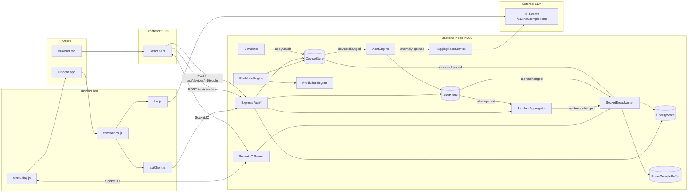

Diagram key features:

- Every arrow labeled `device:changed` / `alerts:changed` / `incidents:changed`
  is a Node.js `EventEmitter` event, not a network hop.
- Everything between `SocketBroadcaster` and `React` / `Relay` is Socket.IO
  frames.
- `HF Router` is called from **two** places: the backend (for anomaly insights)
  and the bot (for polish + `!ask`). Both use the OpenAI wire protocol.

---

# 2. Boot sequence — how the backend comes alive

**File:** `backend/src/server.js` (entry point `npm start` →
`node src/server.js`).

## 2.1 Call sequence

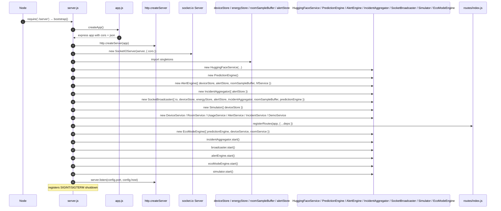

## 2.2 Why this order matters

- **Stores → engines → routes → sockets → simulator.** The simulator is the only
  _producer_ of state changes; every consumer must be attached first, otherwise
  the first tick's events fall on deaf ears.
- **`incidentAggregator.start()` before `alertEngine.start()`** — the aggregator
  subscribes to `alerts:changed`; if it starts after the first alert fires, that
  alert never becomes an incident.
- **`broadcaster.start()` before the simulator** — same reason; the broadcaster
  records the _first_ energy sample so the trapezoidal integration has a
  baseline.

## 2.3 Shutdown path

```
SIGINT/SIGTERM
  ↓
simulator.stop()          // clearInterval, sets _running=false
alertEngine.stop()        // clearInterval, removeListener('device:changed')
ecoModeEngine.stop()      // clearInterval
incidentAggregator.stop() // removeListener('alerts:changed')
broadcaster.stop()        // clearInterval(heartbeat)
io.close()                // stop accepting new sockets
server.close(cb=>process.exit(0))
setTimeout(process.exit(1), 5000).unref()   // hard-kill after 5s
```

The 5-second hard-kill timer is `unref()`'d so it never keeps the process alive
on its own.

---

# 3. In-memory data model (the "database")

All state lives in three EventEmitter-based classes exported as singletons from
`backend/src/store/`.

```mermaid
classDiagram
  class DeviceStore {
    -Map~string,Device~ _byId
    +getAllDevices() Device[]
    +getDeviceById(id) Device|undefined
    +getDevicesByRoom(roomId) Device[]
    +updateDevice(id, next, nowMs) DeviceChange|null
    +updateMultipleDevices(updates, nowMs) DeviceChange[]
    +resetStore()
    +getDwellSeconds(id, nowMs) number
    +getAll() Device[]        // alias
    +applyBatch(updates)      // alias for updateMultipleDevices
    <<emits>> device:changed
    <<emits>> devices:changed
  }
  class EnergyStore {
    -EnergySample[] _samples
    -number _energyWhToday
    -string _dayKey
    +record(watts, nowMs)
    +getEnergyTodayWh()
    +getSamples()
    +getLatestSample()
    +reset(seedWh)
  }
  class RoomSampleBuffer {
    -Map~string, {ts,w}[]~ _data
    +record(roomSnapshots[], nowMs)
    +getSamples(roomId, n)
    +getStats(roomId) {mean,stddev,latest}
  }
  class AlertStore {
    -Map~string,Alert~ _activeBySig
    -Map~string,Alert~ _byId
    +getAll() Alert[]
    +getActive() Alert[]
    +upsert({signature,kind,severity,room,device,message,nowMs}) {alert,opened}
    +resolveMissing(keepSet,nowMs) Alert[]
    +attachInsight(sig, text)
    +emitChanged()
    <<emits>> alert:opened
    <<emits>> alert:updated
    <<emits>> alert:resolved
    <<emits>> alerts:changed
  }
  class IncidentAggregator {
    -Map~string, Incident~ _activeByRoom
    -Map~string, Incident~ _byId
    +evaluate()
    +getActive() Incident[]
    +getAll() Incident[]
    <<emits>> incident:opened
    <<emits>> incident:updated
    <<emits>> incident:resolved
    <<emits>> incidents:changed
  }
  DeviceStore ..> RoomSampleBuffer : sampled by broadcaster
  DeviceStore ..> EnergyStore : sampled by broadcaster
  AlertStore <..> IncidentAggregator : subscribes
```

## 3.1 Shape of a `Device`

```js
{
  id: 'work-room-1-fan-2',       // stable
  label: 'Fan 2',
  type: 'fan',                    // 'fan' | 'light'
  room: 'work-room-1',
  status: 'off',                  // 'on' | 'off'
  wattage: 60,                    // nameplate
  power: 0,                       // 0 when off, wattage when on
  lastChanged: '2026-07-04T...'   // ISO-8601
}
```

## 3.2 Shape of an `Alert`

```js
{
  id: 'alert-lz2af9-3',
  kind: 'room_on_after_hours',
  severity: 'high',               // 'low' | 'medium' | 'high'
  room: 'work-room-1',
  device: null,
  message: 'Work Room 1 is fully ON outside office hours (165W).',
  status: 'active',               // 'active' | 'resolved'
  createdAt, updatedAt, resolvedAt,
  resolved: false,
  aiInsight: null                 // filled in async by HuggingFaceService
}
```

## 3.3 Shape of an `Incident`

```js
{
  id: 'incident-lz2ag0-5',
  room: 'work-room-1',            // or null for '__global__'
  status: 'active',
  severity: 'high',               // max of member severities
  alertIds: ['alert-...', 'alert-...'],
  title: 'work-room-1: 2 alerts (room_on_after_hours, room_on_too_long)',
  createdAt, updatedAt, resolvedAt
}
```

## 3.4 Why defensive copies everywhere

Every `getAllDevices()` returns `Array.from(map.values()).map(d=>({...d}))`.
This makes the store _effectively immutable to consumers_. Framework callers
(React, Discord bot) can mutate returned objects locally without polluting
canonical state.

---

# 4. Feature: Live Device Simulation

## 4.1 Files & modules

| File                                   | Role                                                        |
| -------------------------------------- | ----------------------------------------------------------- |
| `backend/src/config/devices.js`        | Static catalog (3 rooms × 5 devices).                       |
| `backend/src/store/deviceStore.js`     | Owns state, dwell time, events.                             |
| `backend/src/simulator/simulator.js`   | Tick loop and RNG.                                          |
| `backend/src/simulator/officeHours.js` | Pure helpers: `isOfficeHours()`, `transitionProbability()`. |
| `backend/src/config/index.js`          | `SIMULATOR_TICK_MS`, `MIN_DWELL_SECONDS`.                   |

## 4.2 Algorithm

At each tick every device is a two-state Markov process. Whether a device flips
depends on:

1. Its current status (`on` or `off`).
2. Whether it is currently office hours.
3. Its dwell time (must be ≥ `MIN_DWELL_SECONDS`, default 60 s).

Transition probabilities are from `simulator/officeHours.js`:

|             | office hours | outside office hours |
| ----------- | ------------ | -------------------- |
| P(OFF → ON) | 0.35         | 0.03                 |
| P(ON → OFF) | 0.05         | 0.40                 |

This asymmetry produces an office that fills up by mid-morning and empties
within roughly 15–20 minutes of `OFFICE_HOUR_END`.

## 4.3 Sequence per tick

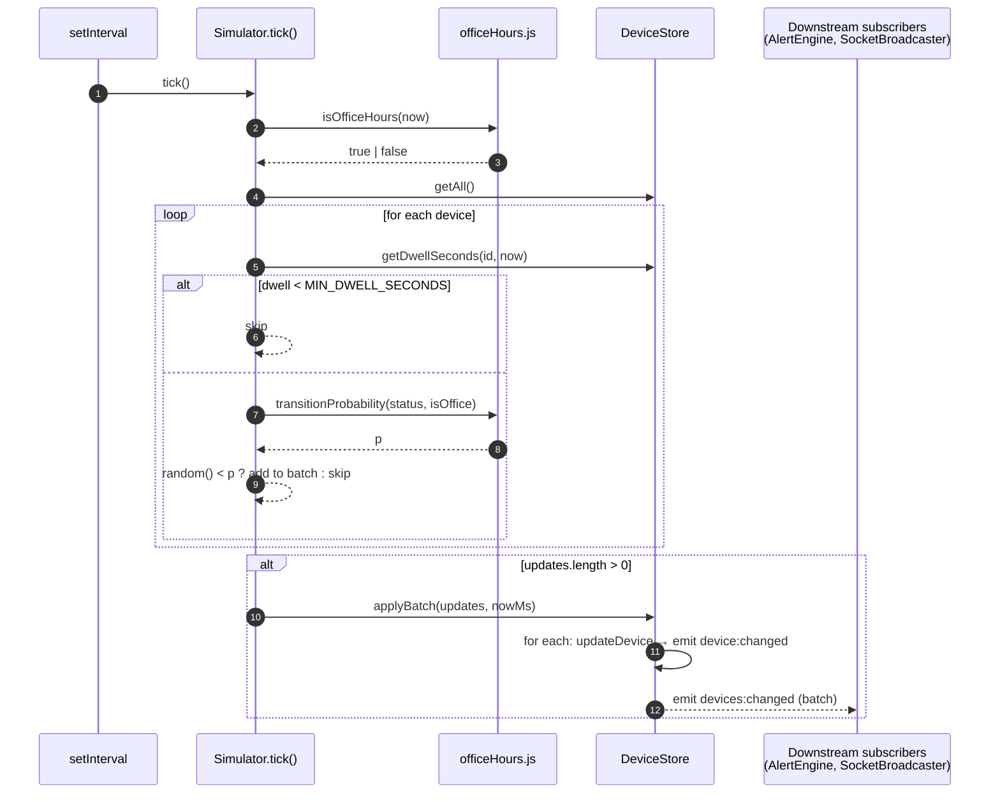

## 4.4 Function-call trace for one turned-on device

`simulator.tick()` → `store.getAll()` → `store.getDwellSeconds(id)` →
`officeHours.transitionProbability('off', true)` (returns `0.35`) →
`Math.random() < 0.35` → `updates.push({id, status:'on'})` → after loop
`store.applyBatch(updates)` → per item `store.updateDevice(id, 'on')` → emits
`device:changed` (per device) → after loop emits `devices:changed` (once) → both
events feed `AlertEngine` and `SocketBroadcaster`.

## 4.5 Design decisions

- **Injectable clock / RNG.** `Simulator({ now, random })` — allows
  deterministic replay in tests.
- **Batch commit.** `applyBatch` fires exactly one `devices:changed` even when
  many devices flip, so downstream cost stays constant per tick.
- **`unref()` on the interval** so the process can exit cleanly.

## 4.6 Edge cases

- If `SIMULATOR_TICK_MS <= 0`, `setInterval` still fires (Node clamps to a
  minimum), but you'll burn CPU. Not validated.
- Devices that just flipped skip their next tick because
  `dwell < MIN_DWELL_SECONDS`.
- After a process restart, all devices reset to `off` and `lastChanged` is
  `boot time`, so no device can flip in the first 60 s.

## 4.7 Limitations

- Independent devices — no coherence (e.g., turning on Fan 1 doesn't make Fan 2
  more likely to switch).
- Office-hour boundary is a sharp step — no smooth ramp.
- No random seed control except by injecting `random`.

---

# 5. Feature: Realtime broadcast (Socket.IO)

## 5.1 Files & modules

| File                                       | Role                                  |
| ------------------------------------------ | ------------------------------------- |
| `backend/src/sockets/socketBroadcaster.js` | Owns _all_ outgoing socket emits.     |
| `backend/src/services/usageService.js`     | Composes the `UsageSnapshot` payload. |
| `backend/src/services/roomService.js`      | Composes `RoomSummary[]`.             |
| `backend/src/services/predictionEngine.js` | Adds `predictions` to each room.      |
| `backend/src/services/powerService.js`     | Pure aggregators.                     |
| `frontend/src/hooks/useLiveData.js`        | Single subscription on the client.    |

## 5.2 Broadcast events

| Event              | Payload                                                      | Cadence                                            |
| ------------------ | ------------------------------------------------------------ | -------------------------------------------------- |
| `devices:update`   | `Device[]`                                                   | on every device change                             |
| `rooms:update`     | `RoomSummary[]` w/ `predictions`                             | on every device change                             |
| `usage:update`     | `UsageSnapshot`                                              | on every device change **and** every 5 s heartbeat |
| `alerts:update`    | `Alert[]`                                                    | on `alerts:changed` (AlertStore)                   |
| `incidents:update` | `Incident[]`                                                 | on `incidents:changed` (IncidentAggregator)        |
| `eco:action`       | `{roomId, roomName, devicesShutdown, savingsBdt, timestamp}` | on `eco:action` (EcoModeEngine)                    |

## 5.3 Sequence on device change

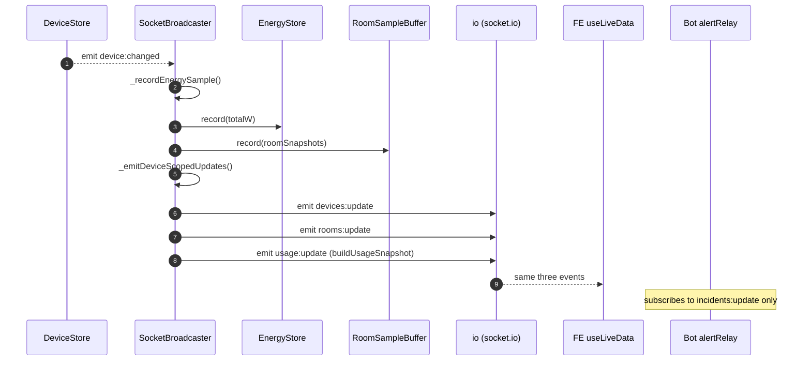

## 5.4 Snapshot on connect

```js
io.on('connection', (socket) => {
  socket.emit('devices:update', deviceStore.getAll());
  socket.emit('rooms:update', _getRoomsWithPredictions());
  socket.emit('usage:update', buildUsageSnapshot(deviceStore, energyStore));
  socket.emit('alerts:update', alertStore.getAll());
  socket.emit('incidents:update', incidentAggregator.getAll());
});
```

Every new client gets a full state snapshot immediately; no client ever needs to
`GET /api/*` for initial data — but the REST endpoints exist so non-Socket.IO
clients (curl, the Discord bot's `apiClient`) can still consume the same truth.

## 5.5 Frontend hook

`frontend/src/hooks/useLiveData.js`:

```js
useEffect(() => {
  const socket = io(BACKEND_URL, {
    transports: ['websocket', 'polling'],
    reconnection: true
  });
  socket.on('connect', () => patch({ connected: true }));
  socket.on('disconnect', () => patch({ connected: false }));
  socket.on('devices:update', (devices) => patch({ devices }));
  socket.on('rooms:update', (rooms) => patch({ rooms }));
  socket.on('usage:update', (usage) => patch({ usage }));
  socket.on('alerts:update', (alerts) => patch({ alerts }));
  socket.on('incidents:update', (incidents) => patch({ incidents }));
  socket.on('eco:action', (payload) => setState(...prependToEco));
  return () => socket.close();
}, []);
```

Each handler triggers exactly one React state batch, which triggers one render.

## 5.6 Design decisions

- **All events go through one class (`SocketBroadcaster`).** Keeps the emit
  graph obvious. Nothing else in the codebase calls `io.emit()`.
- **Full snapshots on connect** — costs one payload per stream but frees the
  frontend from any bootstrap logic.
- **5-second heartbeat** so `usage:update` (which includes `energyToday Kwh`) is
  always fresh even without state changes.

## 5.7 Performance & scalability

- Each `usage:update` payload is ~1 kB; each `devices:update` ~1–2 kB.
- One event ≈ one `JSON.stringify(payload)` + N socket writes.
- Practical cap: ~1000 concurrent dashboards on a single Node process before
  you'd want a Redis adapter.

---

# 6. Feature: Energy accumulation (kWh & BDT)

## 6.1 Files

| File                                    | Role                                            |
| --------------------------------------- | ----------------------------------------------- |
| `backend/src/store/energyStore.js`      | Rolling samples + trapezoidal integrator.       |
| `backend/src/services/energyService.js` | Wh↔kWh helpers, snapshot.                       |
| `backend/src/services/usageService.js`  | Composes final snapshot with cost + projection. |
| `backend/src/config/index.js`           | `TARIFF_BDT_PER_KWH`.                           |

## 6.2 Algorithm — trapezoidal integration

At each `record(currentW, nowMs)`:

```
if (last) {
  hours = (nowMs - last.timestamp) / 3_600_000
  avgW  = (last.powerWatts + currentW) / 2
  energyWhToday += avgW * hours
}
push { timestamp: nowMs, powerWatts: currentW }
if (samples.length > maxSamples) drop oldest
```

At local midnight (`_dayKeyFor(now)` changes), `_energyWhToday` resets.

## 6.3 Cost derivation (in `usageService`)

```
energyTodayKwh          = round(energyTodayWh / 1000, 3)
energyCostBdt           = round(energyTodayKwh * TARIFF_BDT_PER_KWH, 2)
projectedMonthlyKwh     = round(energyTodayKwh * 30, 2)
projectedMonthlyCostBdt = round(energyTodayKwh * 30 * TARIFF_BDT_PER_KWH, 2)
```

## 6.4 Design decisions

- Trapezoidal not rectangular — accurate under variable sample spacing.
- Rolling buffer capped at 2880 samples (≈ 4 h @ 5 s tick) — allows the frontend
  to show sparklines without a DB.
- Naive "× 30" monthly projection — good enough for a hackathon.

## 6.5 Limitations

- Local-time midnight only.
- Reset on backend restart (no persistence).
- Doesn't handle DST shifts explicitly.

---

# 7. Feature: Alert Engine (rule evaluation)

## 7.1 Files

| File                                         | Role                                  |
| -------------------------------------------- | ------------------------------------- |
| `backend/src/alerts/alertEngine.js`          | Rule set + evaluation loop.           |
| `backend/src/alerts/alertStore.js`           | Signature-keyed active/history store. |
| `backend/src/store/roomSampleBuffer.js`      | Baseline data for anomaly rule.       |
| `backend/src/services/roomService.js`        | `summarizeRooms()` used by rules.     |
| `backend/src/services/huggingFaceService.js` | AI insight generator.                 |

## 7.2 Rule catalogue

| Rule id | Kind                    | Severity | Trigger                                                                                 |
| ------- | ----------------------- | -------- | --------------------------------------------------------------------------------------- |
| 1       | `device_on_after_hours` | medium   | Any device with `status='on'` while `isOfficeHours=false`.                              |
| 2       | `room_on_after_hours`   | high     | All devices in a room are ON and `isOfficeHours=false`.                                 |
| 3       | `room_on_too_long`      | high     | All devices in a room are ON continuously for > `ROOM_ON_MAX_HOURS`.                    |
| 4       | `power_anomaly`         | high     | `latestW > mean + 2·stddev` AND `latestW − mean ≥ 45 W`, over the last 60 room samples. |

## 7.3 Sequence of one evaluation pass

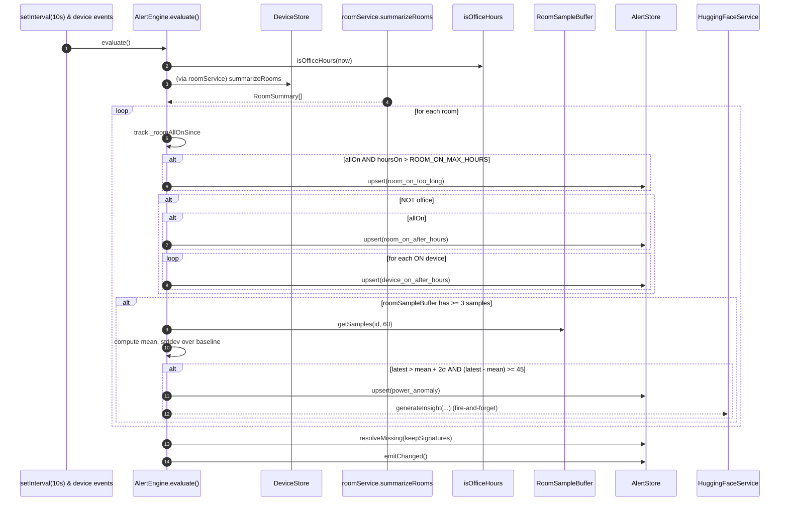

## 7.4 Upsert semantics (AlertStore)

Every alert has a **signature** deterministic in its condition, e.g.:

- `room-on-too-long:work-room-1`
- `room-on-after-hours:drawing-room`
- `device-on-after-hours:drawing-room-fan-1`
- `power-anomaly:work-room-2`

`AlertStore.upsert()`:

- If signature already exists in `_activeBySig`, refresh `severity` / `message`
  and `updatedAt`; emit `alert:updated` if changed.
- Otherwise create a fresh `Alert`, insert into both maps, emit `alert:opened`.
  If `_byId.size > 500`, evict oldest key.

`AlertStore.resolveMissing(keepSet)`:

- Iterate `_activeBySig`; any signature not in `keepSet` is marked
  `resolved: true`, `resolvedAt: now`, removed from `_activeBySig`, and
  `alert:resolved` is emitted.

This gives **idempotent** rule evaluation: calling `evaluate()` twice with
unchanged state yields exactly the same active set.

## 7.5 Design decisions

- **Signatures as identity.** Prevents duplicate alerts and enables
  auto-resolve.
- **Fire-and-forget AI insight.** LLM latency doesn't block the alert loop.
- **Anomaly rule uses baseline _excluding_ the latest sample** so the spike
  itself doesn't inflate the mean.

## 7.6 Edge cases

- With few samples, no anomaly is fired (needs ≥ 3).
- With baseline mean ≈ 0, the 45 W absolute-jump guard prevents 15 W false
  positives.
- Alert engine subscribes to both `device:changed` and `devices:changed`;
  batches trigger evaluation twice (idempotent but wasteful).

## 7.7 Limitations

- Global anomaly threshold; no per-room learning.
- No cool-down: a metric hovering at the boundary can flap active/resolved.
- Only one anomaly rule; no rules for e.g. "fan on, all lights off → unusual".

---

# 8. Feature: Incident Aggregation

## 8.1 Files

- `backend/src/incidents/incidentAggregator.js`.

## 8.2 Grouping policy

Exactly **one active incident per room** (or `__global__` for `room === null`).
Every active alert for that room is attached; when the room has no active alerts
left, the incident is resolved.

## 8.3 State diagram

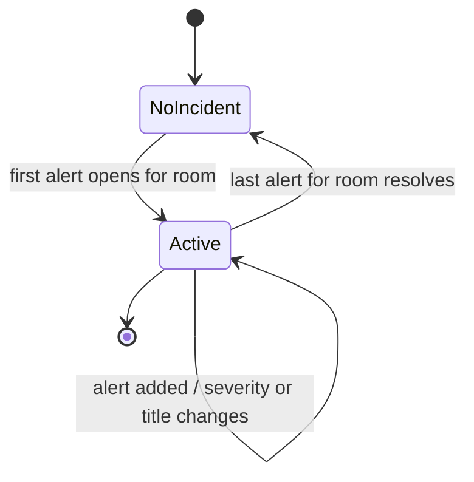

## 8.4 Rollup rules

- `severity = max(severity of member alerts)` (order: high > medium > low).
- `title = `${roomKey}: ${n} alert(s) (${sortedKinds.join(', ')})`.
- `alertIds` is sorted for stable equality checks.

## 8.5 Trigger cadence

Subscribes to `AlertStore`'s three events (`alert:opened`, `alert:resolved`,
`alerts:changed`). Each firing calls `evaluate()` which recomputes from the
current active-alert snapshot; only emits `incidents:changed` if something
_actually_ changed.

## 8.6 Trade-offs

- **Pro.** Simple; O(A + R) per re-eval where A=active alerts, R=rooms.
- **Con.** A user cannot pin, snooze, or manually resolve incidents — they
  auto-resolve strictly when member alerts clear.

---

# 9. Feature: Occupancy Prediction (logistic regression)

## 9.1 Files

- `backend/src/services/predictionEngine.js`.

## 9.2 Model

Four features + bias, sigmoid activation:

| feature                   | weight |
| ------------------------- | ------ |
| `bias`                    | −2.0   |
| `fanOnCount`              | +1.5   |
| `lightOnCount`            | +1.0   |
| `minutesSinceChange`      | −0.05  |
| `officeHoursActive` (0/1) | +2.0   |

`z = bias + Σ (feature × weight); p = σ(z) = 1 / (1 + e^-z); occupied = p ≥ 0.5`

## 9.3 Extras — potential savings

For unoccupied rooms with `currentPowerW > 0`:

```
hoursRemaining = max(1, officeHourEnd - currentHour)  // hours until close of business
savings BDT   = (currentPowerW / 1000) * hoursRemaining * TARIFF_BDT_PER_KWH
```

Reported only when the room is predicted unoccupied — a small "call-to-action"
number for the dashboard.

## 9.4 Where it's called

- `SocketBroadcaster._getRoomsWithPredictions()` — every device event.
- `roomsRouter.js` — on every `GET /api/rooms` and `GET /api/rooms/:id`.
- `ecoModeEngine._evaluate()` — every 30 s.

## 9.5 Trade-offs

- Weights are hand-picked heuristics. In production you'd fit real logistic
  regression coefficients from labelled data.
- No hysteresis — a room can flip between `occupied` and `unoccupied` from tick
  to tick if `p` is near 0.5. Eco-Mode's 5-min grace period smooths this in
  practice.

---

# 10. Feature: Eco-Mode auto-shutdown

## 10.1 Files

- `backend/src/services/ecoModeEngine.js`.
- `backend/src/services/DeviceService.js#shutdownRoom()`.
- `frontend/src/components/EcoToast.jsx`.

## 10.2 Loop (every 30 s)

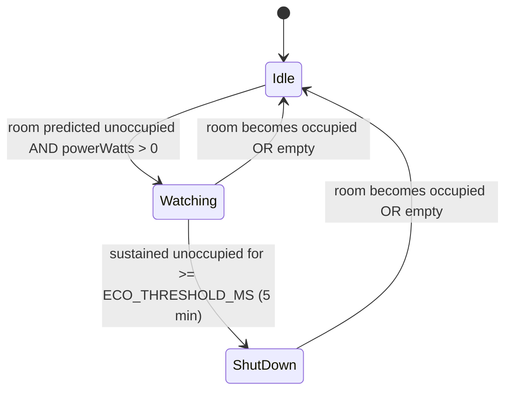

## 10.3 Sequence

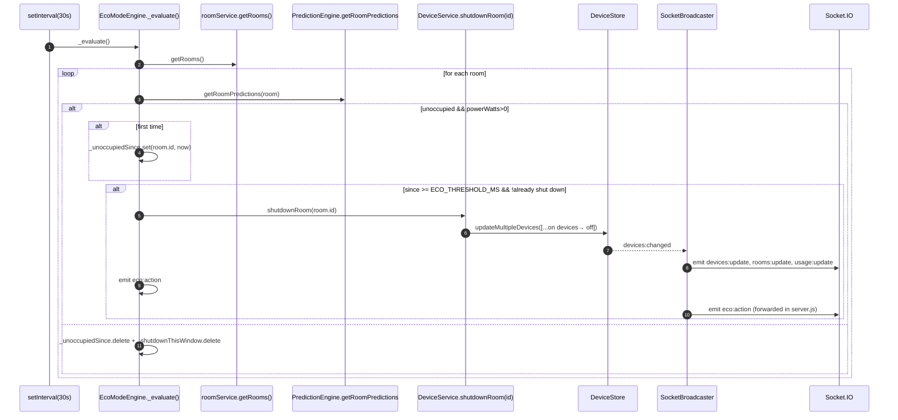

## 10.4 Toast rendering (frontend)

`useLiveData` handler:

```js
socket.on('eco:action', (payload) => {
  setState((s) => ({
    ...s,
    ecoNotifications: [
      { ...payload, id: `${payload.roomId}-${Date.now()}` },
      ...s.ecoNotifications
    ].slice(0, 5)
  }));
});
```

`App.jsx` filters by a `dismissed` set of IDs and renders `<EcoToast>`, which
uses Framer Motion for stack entry/exit animation.

## 10.5 Design decisions & edge cases

- **`_shutdownThisWindow` guard** — prevents re-triggering `shutdownRoom` every
  30 s while the room stays unoccupied.
- **State reset on occupancy** clears both timers so a fresh window can start.
- **`.toFixed(2)` on savings** ensures nice numbers reach the client.
- **Direct `Date.now()` inside `_evaluate`** — engine ignores the clock
  injection pattern used elsewhere, making time-travel tests harder.

---

# 11. Feature: AI Insights (HuggingFace)

## 11.1 Files

- `backend/src/services/huggingFaceService.js`.
- `backend/src/alerts/alertEngine.js` (call site).
- `backend/src/alerts/alertStore.js#attachInsight`.
- `frontend/src/components/AIInsightCard.jsx`.

## 11.2 Pipeline

```mermaid
sequenceDiagram
  autonumber
  participant AE as AlertEngine.evaluate()
  participant HF as HuggingFaceService.generateInsight
  participant Cache as _cache Map (≤50)
  participant Router as HF Router /v1/chat/completions
  participant AS as AlertStore
  participant IO as Socket.IO
  participant FE as AIInsightCard

  AE->>HF: generateInsight({ signature, roomName, currentW, baselineW, deviationPct, activeDevices[], isOfficeHours, energyCostBdt, tariff })
  alt no token
    HF-->>AE: null (silent)
  else cached
    HF-->>Cache: has signature?
    Cache-->>HF: cached text
    HF-->>AE: cached text (still async but resolves fast)
  else
    HF->>HF: _buildPrompt(ctx)
    HF->>Router: POST with Bearer HF_API_TOKEN, model, temperature=0.4, max_tokens=120
    Router-->>HF: choices[0].message.content
    HF->>Cache: set(signature, text); evict oldest if size>50
    HF-->>AE: text
  end
  AE->>AS: attachInsight(signature, text)
  AS->>AS: alert.aiInsight = text; updatedAt = now
  AS->>IO: emit alerts:changed (via emitChanged)
  IO-->>FE: alerts:update with aiInsight populated
  FE-->>FE: render AIInsightCard
```

## 11.3 Prompt template (backend)

The prompt is fully server-controlled — no user string is ever interpolated. It
contains:

- Fixed office description (2 fans + 3 lights per room, 165 W max).
- Anomaly context (room, W now, baseline, deviation %, active devices,
  office-hours flag, cost so far, tariff, excess cost/hour).
- Task list (diagnose, recommend, quantify).
- Strict tone constraint (no emojis, ≤ 60 words).

## 11.4 Reliability mechanisms

- 35 s `AbortSignal` timeout via `AbortController`.
- All HTTP errors → `logger.warn` and return `null`.
- Cache eviction if `size > 50` (FIFO).
- `invalidate(signature)` called when an alert resolves — reserves cache for
  currently open anomalies.

## 11.5 Failure isolation

An LLM outage never breaks the alert loop; the `AIInsightCard` simply never
renders (`if (!insight) return null;`).

---

# 12. Feature: REST API surface

## 12.1 Router registry (`backend/src/routes/index.js`)

```
app.use('/api/devices',   createDevicesRouter(deps));
app.use('/api/rooms',     createRoomsRouter(deps));
app.use('/api/usage',     createUsageRouter(deps));
app.use('/api/alerts',    createAlertsRouter(deps));
app.use('/api/incidents', createIncidentsRouter(deps));
app.use('/api/demo',      createDemoRouter(deps));
app.use('/api/simulate',  createSimulateRouter(deps));
app.use('/api', (_req, res) => res.status(404).json({ error:'not_found' }));
app.use((err, _req, res, _next) => res.status(500).json({ error:'internal_error' }));
```

## 12.2 Envelope

`backend/src/utils/apiResponse.js`:

```js
success(res, data, 200) → { success:true, data }
error(res, msg, 500, code) → { success:false, error:{ message, code } }
```

Every router uses these helpers _except_ `GET /api/health`, which is defined in
`app.js` and returns `{ status:'ok', uptime }` (legacy shape).

## 12.3 Router factories — pattern

Each `routes/xRouter.js` exports:

```js
function createXRouter({ deviceStore, /* ... */ }) {
  const router = express.Router();
  router.get('/', ...);
  router.get('/:id', ...);
  // maybe router.post(...)
  return router;
}
module.exports = { createXRouter };
```

Deps are injected explicitly — no imports of singletons from within routers.
Improves testability (tests can pass stub stores) and makes dependency graphs
visible in `server.js`.

## 12.4 Handler wiring

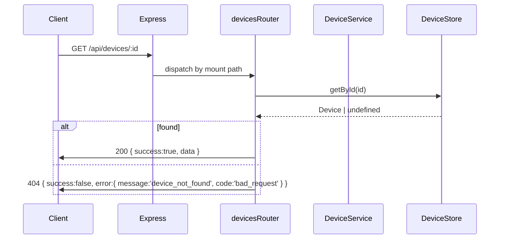

## 12.5 Error handling

- `usageRouter`, `demoRouter`, `simulateRouter` wrap in `try/catch` and call
  `next(err)`.
- Other routers rely on synchronous errors bubbling into the tail error-handler
  at `routes/index.js`.
- `middleware/errorHandler.js` exists but is _not_ wired — a minor debt item.

---

# 13. Feature: Device toggle (dashboard → backend → all clients)

Perhaps the single most illustrative end-to-end flow.

## 13.1 Files

- `frontend/src/components/RoomCard.jsx` (`DeviceChip.handleToggle`).
- `backend/src/routes/devicesRouter.js` (`POST /:id/toggle`).
- `backend/src/services/DeviceService.js#toggle`.
- `backend/src/store/deviceStore.js#updateDevice`.
- `backend/src/sockets/socketBroadcaster.js`.

## 13.2 Trace

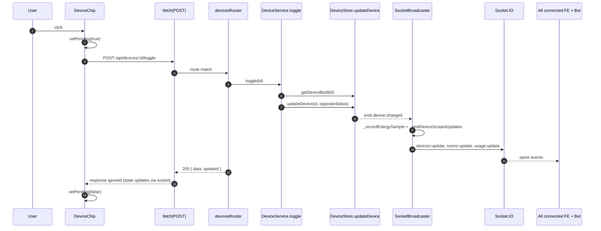

## 13.3 Optimism model

The chip **doesn't** apply an optimistic UI update. It waits for the Socket.IO
event, which is fast on localhost. This trades responsiveness for consistency
(no reconciliation needed if the request fails).

## 13.4 Concurrency

- `updateDevice` is a no-op when status is already the requested value.
- Two rapid clicks: first one flips; second one is a no-op.
- Two clients toggling the same device simultaneously — last write wins; both
  eventually see the same final state via the broadcast.

## 13.5 Security

- No auth — anyone can toggle any device. See §12 of `PROJECT_ANALYSIS.md`.

---

# 14. Feature: Digital Twin / `POST /api/simulate`

## 14.1 Files

- `frontend/src/App.jsx` (`isSimMode`, `simulatedDevices`,
  `handleToggleSimMode`, `handleDeviceToggle`).
- `frontend/src/components/SimulationPanel.jsx`.
- `frontend/src/components/OfficeLayout.jsx` (`isSimMode` prop).
- `backend/src/routes/simulateRouter.js`.
- `backend/src/services/simulateService.js`.
- `backend/src/alerts/alertEngine.js` + `alertStore.js` (used statelessly).

## 14.2 What happens in "Sim Mode"

- Frontend deep-clones `devices` into local `simulatedDevices` state.
- Clicks on the floor plan or elsewhere mutate `simulatedDevices` only.
- `SimulationPanel` computes a diff and calls
  `POST /api/simulate { simulatedDevices }`.
- Backend runs `evaluateSimulation()` — power totals + monthly cost +
  hypothetical alerts — without touching any real state.

## 14.3 Backend sequence

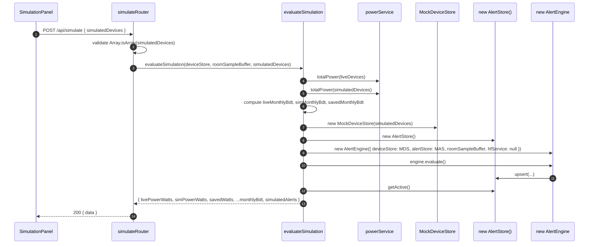

## 14.4 Why it's a stateless simulation

`AlertEngine` binds to `deviceStore` events at `start()` time. Here we never
call `start()`; we directly invoke `evaluate()`, which reads
`this._devices.getRooms()` and `getAll()`. The `MockDeviceStore` only implements
those two + `on/off` no-ops, which is enough.

## 14.5 Trade-offs

- Reuses real rule logic → guaranteed parity between live and simulated alerts.
- Full deep-copy on every simulation click → slightly wasteful but simple.
- No validation on individual device shape — a malformed input can throw inside
  `powerService`.

---

# 15. Feature: Demo scenarios

## 15.1 Files

- `frontend/src/components/DemoControls.jsx`.
- `backend/src/routes/demoRouter.js`.
- `backend/src/services/DemoService.js`.

## 15.2 Scenarios

| Scenario                         | Action                                                                  |
| -------------------------------- | ----------------------------------------------------------------------- |
| `everything-off`                 | Turn all devices OFF; seed `energyStore` with 12.4 kWh for demo optics. |
| `high-power` / `office-hours`    | Turn all devices ON.                                                    |
| `alert-scenario` / `after-hours` | Drawing Room ON, others OFF.                                            |

## 15.3 Trace

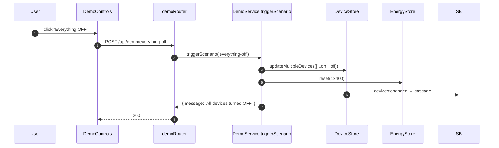

## 15.4 Security

- Publicly accessible. Anyone can trigger. Should be gated behind an API key
  before production.

---

# 16. Feature: Discord bot — prefix commands

## 16.1 Files

- `bot/src/index.js` — Client bootstrap, message router.
- `bot/src/commands.js` — command registry.
- `bot/src/formatters.js` — deterministic template output.
- `bot/src/llm.js#polish` — optional LLM polish.
- `bot/src/apiClient.js` — HTTP wrapper.

## 16.2 Message flow

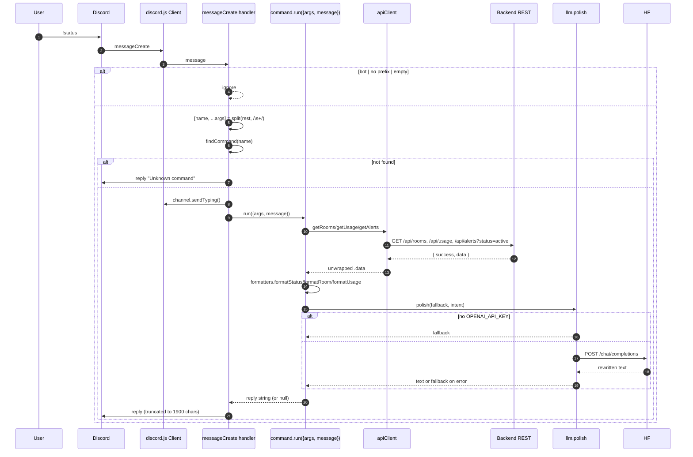

## 16.3 Alias resolver for `!room`

```
raw query → lowercased → strip [\s_-] → lookup in aliasMap:
  drawing / drawingroom       → drawing-room
  work1 / workroom1 / w1      → work-room-1
  work2 / workroom2 / w2      → work-room-2
```

Also compares against `room.id` and `room.name` (both lowercased and stripped).
Ensures `!room work1` (spec example) works.

## 16.4 Response contract

- If `run()` returns a string, `index.js` replies with it (truncated to 1900
  chars + ellipsis).
- If it returns `null` (only `!ask` does), the command self-manages its reply
  lifecycle (edits a placeholder message).

## 16.5 Error handling

- Any thrown error inside `command.run()` is caught in `index.js` and echoed to
  the user as `"Command failed: <message>"`.
- Network errors from `apiClient.get()` bubble up naturally with a descriptive
  `Error` message.

## 16.6 Design decisions

- Prefix commands (not slash commands) — simpler to demo, no need to register
  with Discord's application command API.
- `polish()` is a _decoration_, not a _replacement_. The template always
  contains the ground truth; the LLM only rewrites tone.

---

# 17. Feature: Discord bot — proactive alerts (Socket.IO relay)

## 17.1 Files

- `bot/src/alertRelay.js`.
- `bot/src/config.js` (`alertChannelIds`).
- `bot/src/formatters.js#formatIncident`.

## 17.2 Behaviour

- If `ALERT_CHANNEL_IDS` is empty, relay is disabled (no socket connection
  made).
- Otherwise:
  1. Open Socket.IO client to `BACKEND_WS_URL`.
  2. On the **first** `incidents:update` payload, seed `knownIncidentIds` and
     mark bootstrapped — do not post anything. This prevents replaying old
     incidents on bot restart.
  3. On subsequent payloads, for each incident that is (a) `active` and (b) not
     already in `knownIncidentIds`: add to known set, format, polish, post to
     every configured channel.

## 17.3 Sequence

```mermaid
sequenceDiagram
  autonumber
  participant Relay as alertRelay
  participant IO as Backend Socket.IO
  participant Discord
  participant LLM as llm.polish

  Relay->>IO: connect (websocket/polling, reconnection:true)
  IO-->>Relay: incidents:update (initial snapshot)
  Relay->>Relay: seed knownIncidentIds; bootstrapped=true
  loop later
    IO-->>Relay: incidents:update
    Relay->>Relay: fresh = incidents with status='active' AND id ∉ known
    loop for channelId in config.alertChannelIds
      Relay->>Discord: channels.fetch(channelId)
      loop for incident in fresh
        Relay->>Relay: raw = formatIncident(incident)
        Relay->>LLM: polish(raw, 'urgent automated alert')
        Relay->>Discord: channel.send(polishedMessage)
      end
    end
  end
```

## 17.4 Edge cases

- Channel fetch failure → log warning, skip.
- Non-text-based channel → skip.
- `send` failure → log warning, continue with next incident.

## 17.5 Reliability

- `reconnection: true` on the socket handles backend restarts.
- Bootstrap-guard prevents spam on relay restart.
- No persistence of `knownIncidentIds` across bot restarts → a long-running
  incident may be re-posted after a bot restart (mostly harmless because the
  _first_ snapshot re-seeds).

---

# 18. Feature: Discord bot — `!ask` tool-calling agent

## 18.1 Files

- `bot/src/llm.js#askQuestion` and `tools` / `toolHandlers`.
- `bot/src/apiClient.js` (the actual data fetchers).

## 18.2 Tool schema

```js
[
  { type: 'function', function: { name: 'getUsage', description: '…' } },
  { type: 'function', function: { name: 'getRooms', description: '…' } },
  { type: 'function', function: { name: 'getAlerts', description: '…' } },
  { type: 'function', function: { name: 'getIncidents', description: '…' } }
];

toolHandlers = {
  getUsage: () => apiClient.getUsage(),
  getRooms: () => apiClient.getRooms(),
  getAlerts: () => apiClient.getAlerts(),
  getIncidents: () => apiClient.getIncidents()
};
```

## 18.3 Loop

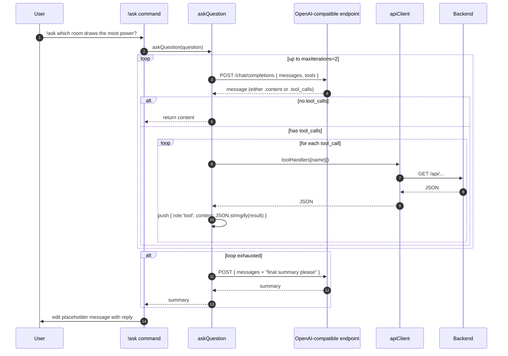

## 18.4 Guardrails

- System prompt scopes the model to office-power topics and forbids state
  mutations.
- 8 s timeout per completion; 5 s for the fallback summary.
- Max 2 tool-round iterations to bound cost/latency.

---

# 19. Frontend: dashboard rendering pipeline

## 19.1 Component tree

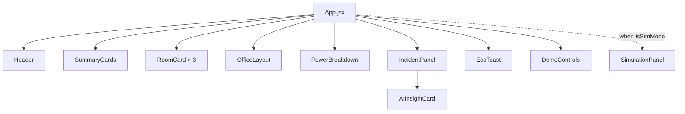

## 19.2 Data flow

- `useLiveData()` returns
  `{ connected, devices, rooms, usage, alerts, incidents, ecoNotifications }`.
- `App` fans this out as props.
- Presentation components are pure; every re-render is caused by a socket event
  (or a local `useState` change in `App`).

## 19.3 Rendering rules

- **SummaryCards** — 4 stat cards; recomputes `active` from `alerts` on every
  render (cheap for N=15).
- **RoomCard** — utilisation bar, sparkline of `room.samples`, occupancy badge
  (`room.predictions.predictedState`), chips (`DeviceChip`).
- **OfficeLayout** — hover/select state local; devices displayed via positions
  defined in the module.
- **PowerBreakdown** — computes per-room % on the fly.
- **IncidentPanel** — active incidents + last 8 alerts; expands `AIInsightCard`
  under any active `power_anomaly` alert.
- **EcoToast** — filters `notifications` by `dismissed` set; renders Framer
  Motion presence animations.

## 19.4 Performance notes

- No `useMemo` / `useCallback` — unnecessary at 15 devices.
- Framer Motion animations run on the compositor via CSS transforms.
- Vite dev server uses ESM native imports → fast HMR.
- Production bundle: served by nginx-unprivileged with hashed asset filenames
  (default cache headers).

---

# 20. Frontend: floor-plan SVG internals

## 20.1 File

- `frontend/src/components/OfficeLayout.jsx`.

## 20.2 Coordinate system

- Global SVG `viewBox="0 0 860 520"`.
- `roomSlots[]` — three rooms in horizontal strip:
  - Drawing Room `(x=20, y=60, w=260, h=360)`
  - Work Room 1 `(x=300, y=60, w=260, h=360)`
  - Work Room 2 `(x=580, y=60, w=260, h=360)`
- `lightSlots[]` / `fanSlots[]` — local coordinates inside a room.
- Absolute position = `slot.x + local.x`, `slot.y + local.y`.

## 20.3 SVG tricks

- **Door cutouts** — `<mask id="door-mask-${slot.id}-${uid}">` with a black
  rectangle where the door goes; used on the room's outer `<rect>` stroke.
- **Main entry cutout** — a similar mask on the outer building outline.
- **Room walls with dashed outer border** — visualised as `stroke-dasharray`.
- **Fan spin** — `<motion.g animate={{ rotate: 360 }}>` with duration inversely
  proportional to wattage (see `FanIcon`).
- **Light halo** — two concentric `<motion.circle>` rings expanding on a 2 s
  loop with staggered delay.
- **Anomaly heat pulse** — red radial gradient overlay whose `opacity` animates
  `[0.3, 1, 0.3]` on rooms with an active `power_anomaly`.
- **Heatmap colouring** — room fill switches between four colours based on
  `onCount / totalDevices` (vacant, low, high, hot).

## 20.4 Interaction model

- Mouse move updates `mouseX/mouseY` Framer Motion values → tooltip position.
- Hover on a device sets `hoverId`.
- Click on a device:
  - **Live mode.** `setSelectedId(id)` → detail modal opens.
  - **Sim mode.** `onDeviceToggle(id)` (from `App.jsx`) mutates
    `simulatedDevices` locally.

## 20.5 `useId()` for SVG defs

Every gradient, mask, and pattern includes a per-instance UID from `useId()`
(colons stripped) so multiple OfficeLayout instances on the same page never
collide on `id` attributes.

---

# 21. Middleware, utilities, and cross-cutting concerns

## 21.1 Utilities

| File                               | Responsibility                                                                              |
| ---------------------------------- | ------------------------------------------------------------------------------------------- |
| `backend/src/utils/apiResponse.js` | `success(res, data, code=200)` / `error(res, msg, code=500, errorCode)`. Standard envelope. |
| `backend/src/utils/logger.js`      | Level-prefixed timestamped stdout logger. Levels: info, warn, error, debug.                 |
| `frontend/src/lib/format.js`       | `formatWatts`, `formatKwh`, `formatRelative`, `severityClasses`.                            |
| `bot/src/formatters.js`            | Deterministic templates for status/room/usage/alert/incident.                               |

## 21.2 Middleware

| File                                      | Wired?                                                      | Purpose                                                          |
| ----------------------------------------- | ----------------------------------------------------------- | ---------------------------------------------------------------- |
| `backend/src/middleware/errorHandler.js`  | **No** — routes/index.js installs a simpler inline handler. | Logs errors, guards against `headersSent`, returns 500 envelope. |
| `backend/src/middleware/requestLogger.js` | **No** — not mounted.                                       | Logs `method`, `url`, `status`, `durationMs`, `ip`.              |
| `backend/src/middleware/validator.js`     | **No** — every route hand-validates.                        | `validateQueryEnum(param, allowed, defaultVal)`.                 |
| CORS + JSON body parser                   | **Yes** — in `app.js`.                                      | `cors({ origin: config.corsOrigin })`, `express.json()`.         |

## 21.3 Configuration

- All env → config resolution happens in `backend/src/config/index.js` and
  `bot/src/config.js`. Every other file `require('../config')` and reads fields.
- No env access after boot; makes runtime configuration testable (import fresh
  module in tests).

## 21.4 Logging conventions

- `logger.info('X started', { meta })` for lifecycle events.
- `logger.warn(...)` for expected failures (LLM timeout, channel fetch).
- `logger.error(...)` for unexpected errors.
- `logger.debug(...)` for tick-level diagnostics — enabled only when the
  environment sets log level to `debug` (currently unfiltered).

---

# 22. Configuration & environment resolution

## 22.1 Resolution rules

- Each service loads its own `.env` at boot via `dotenv.config()`.
- Root `.env` (if any) is not loaded automatically by any service.
- Docker Compose injects env vars into containers, overriding `.env` files
  inside images.

## 22.2 Backend config object

```js
{
  port: 4000, host: '0.0.0.0',
  corsOrigin: 'http://localhost:5173' | '*',
  simulatorTickMs: 5000, minDwellSeconds: 60,
  officeHourStart: 9, officeHourEnd: 17,
  roomOnMaxHours: 2, tariffBdtPerKwh: 7.0,
  hfApiToken: string|null, hfModel: 'meta-llama/…'
}
```

## 22.3 Bot config object

```js
{
  discordToken, commandPrefix: '!',
  alertChannelIds: ['id1','id2'],
  backendHttpUrl: 'http://localhost:4000',
  backendWsUrl: 'http://localhost:4000',
  openAiApiKey, openAiModel, openAiBaseUrl
}
```

## 22.4 Frontend build-time env

- Vite exposes only `VITE_*`.
- `VITE_BACKEND_URL` and `VITE_SOCKET_URL` are read at build time and baked into
  the bundle (`import.meta.env.VITE_BACKEND_URL`).
- Changing them requires a rebuild — that's why docker-compose passes them as
  `args` to the Dockerfile.

---

# 23. Deployment implementation

## 23.1 Local development

- `npm install` at root installs all three workspaces (npm workspaces).
- `npm run dev` runs `concurrently` with `backend` + `frontend`.
- `npm run dev:bot` runs the bot separately (kept out of `dev` because it
  requires `DISCORD_TOKEN`).

## 23.2 Docker Compose

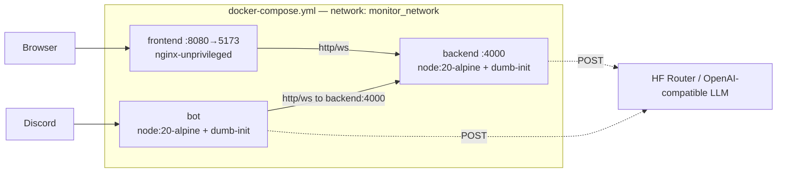

## 23.3 Dockerfiles

- **Backend & Bot** — `node:20-alpine`, `dumb-init` for signal propagation,
  non-root `USER node`, healthcheck via `wget /api/usage` (backend) or
  `pgrep node` (bot).
- **Frontend** — multi-stage:
  1. `node:20-alpine` runs `npm install && npm run build` with
     `VITE_BACKEND_URL` / `VITE_SOCKET_URL` build args.
  2. `nginxinc/nginx-unprivileged:alpine` copies `dist/` and serves on port 8080
     (mapped to host 5173).

## 23.4 Compose environment injection

- Backend env vars come from the host `.env` file (via
  `${SIMULATOR_TICK_MS:-5000}` defaults) — the compose file overrides
  `PORT=4000` even though the backend Dockerfile ships with `PORT=7860` (for
  HuggingFace Spaces compatibility).
- Bot env vars similarly come from host `.env` (`DISCORD_TOKEN`, etc.), and
  `BACKEND_HTTP_URL` is set to `http://backend:4000` (Docker DNS) overriding any
  local value.

---

# 24. Reusable patterns catalogue

| Pattern                                | Where used                                                          | Why                                                              |
| -------------------------------------- | ------------------------------------------------------------------- | ---------------------------------------------------------------- |
| **Composition root**                   | `backend/src/server.js#bootstrap()`                                 | One place instantiates everything; keeps object graph obvious.   |
| **Router factory**                     | `backend/src/routes/*.js`                                           | `createXRouter({ deps })` — testable, DI-friendly.               |
| **Store singletons + class exports**   | `store/index.js`                                                    | Ad-hoc callers get the singleton; tests can `new DeviceStore()`. |
| **Signature-keyed upsert store**       | `alertStore.js`                                                     | Idempotent rule evaluation.                                      |
| **Auto-resolve by set diff**           | `alertStore.resolveMissing(keepSet)`                                | Stateless rule model — clean semantics.                          |
| **Pure aggregator modules**            | `powerService`, `energyService`                                     | Deterministic, testable, no I/O.                                 |
| **Injectable clock + RNG**             | `Simulator`, `AlertEngine`, `IncidentAggregator`                    | Deterministic tests.                                             |
| **Standard response envelope**         | `apiResponse.js`                                                    | Consistent client parsing.                                       |
| **Fallback + polish**                  | `bot/src/llm.js#polish`                                             | LLM is a decoration, not a source of truth.                      |
| **Tool-calling loop with hard cap**    | `bot/src/llm.js#askQuestion`                                        | Bounds cost, protects from infinite loops.                       |
| **Snapshot-on-connect**                | `socketBroadcaster.js`                                              | New clients need no bootstrap logic.                             |
| **Fire-and-forget async augmentation** | `AlertEngine → HuggingFaceService → attachInsight`                  | LLM latency doesn't block the rule loop.                         |
| **Dependency-injected engines**        | `AlertEngine`, `SocketBroadcaster`, `EcoModeEngine`                 | Composable, testable, no globals.                                |
| **Batch-then-notify**                  | `updateMultipleDevices` fires one `devices:changed` after the batch | Downstream cost independent of batch size.                       |
| **Client-side deep-copy for what-if**  | Digital Twin `simulatedDevices`                                     | Simulate without mutating live state.                            |
| **Timer `unref()`**                    | Every `setInterval` in the backend                                  | Clean shutdown; process can exit if nothing else is pending.     |

---

# 25. Reliability, scalability, and improvement ideas

## 25.1 Reliability mechanisms already in place

- Graceful degradation whenever an LLM call fails.
- Auto-reconnect on Socket.IO client (`reconnection: true`).
- Bootstrap snapshot on socket connect — no lost updates for late clients.
- `resolveMissing()` semantics prevent orphan alerts.
- Signal handlers stop every subsystem in reverse order.
- Non-root containers.
- Healthchecks in every Docker service.

## 25.2 Scalability considerations

- Single-instance state → cannot scale horizontally without a shared store
  (Redis) and Socket.IO Redis adapter.
- All CPU work is O(N) where N = 15 devices → orders of magnitude of headroom
  vertically.
- Broadcast fan-out is the natural bottleneck at very high client counts (~1000
  concurrent connections start to matter).

## 25.3 Potential improvements (prioritised)

1. **Authentication + rate limiting** on mutating routes
   (`POST /api/devices/:id/toggle`, `POST /api/demo/:scenario`).
2. **Wire `errorHandler` and `requestLogger` middleware**; remove the inline
   error handler in `routes/index.js`.
3. **Persist alerts and incidents to SQLite** behind a decorator so the
   in-memory store stays fast for reads.
4. **Introduce Vitest** for pure modules (`powerService`, `energyService`,
   `officeHours`, `alertStore`, `incidentAggregator`, `predictionEngine`).
5. **Add an integration test** that spins up the backend and asserts the full
   end-to-end socket contract.
6. **Replace prefix commands with Discord slash commands** in the bot for a
   first-class UX.
7. **Add motion.reduce-motion respect** on the frontend for accessibility.
8. **Move device catalog to a JSON file** with hot-reload support.
9. **Introduce a Prometheus exporter** (`prom-client`) for per-room W, alert
   counts, LLM latency, socket connection count.
10. **Add a GitHub Actions workflow** for lint + tests on every push.
11. **Sign the Discord bot commands** by restricting to specific roles or
    channels.
12. **Remove the empty `office-power-monitor/` skeleton** at the repo root —
    pure noise.
13. **Fix doubled file extensions** in `hardware/` (`.ino.ino`, `.txt.txt`).
14. **Replace README `via.placeholder.com` stubs** with real screenshots of the
    running dashboard.
15. **Explicit timezone handling** in `EnergyStore._dayKeyFor` (right now it
    uses server-local time only).

## 25.4 Summary of "how this is really glued together"

- Everything hangs off **one `DeviceStore`**. Every subsystem reads from it or
  subscribes to its events. Change the store and the whole system reacts.
- **Rules → Alerts → Incidents** is a strict pipeline: rules produce alerts
  (signature-keyed), incidents group alerts (per room), both auto-resolve when
  the underlying condition clears.
- **All fan-out is through `SocketBroadcaster`.** No other file emits socket
  events. This makes the broadcast contract auditable in one place.
- **AI is always additive.** Every AI touchpoint (HF insights, LLM polish,
  `!ask`) is optional; missing keys or failed calls do not affect the
  deterministic core.
- **The Discord bot is architecturally identical to a second dashboard.** It
  consumes the same Socket.IO stream and the same REST API. Adding a Slack bot
  or a mobile app would follow the same pattern with zero backend changes.

---

_End of IMPLEMENTATION_GUIDE.md._
