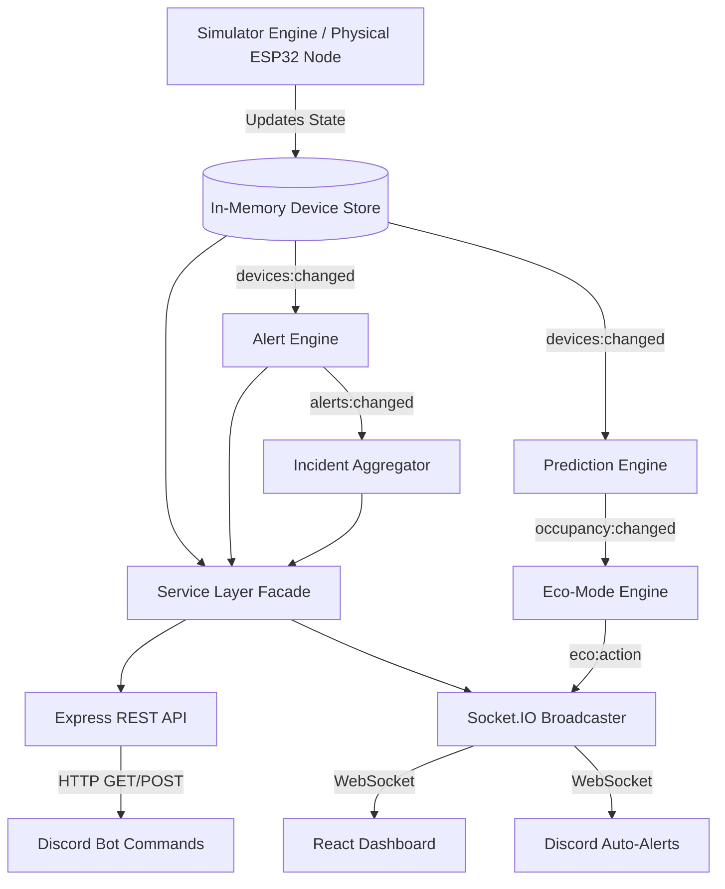

<div align="center">
  

# Office Power Monitor

**Real-Time Office Electricity & IoT Management Platform**

[](#)
[](#)
[](#)
[](#)
[](#)
[](#)

</div>

<div align="center">
  <h3>
    ▶️ <a href="https://app.arcade.software/share/videos/KrLwPHW1tuH0982DBw1j">Interactive Arcade Demo</a>
    &nbsp;|&nbsp;
    🎥 <a href="https://drive.google.com/file/d/1BOZT1sJ4jq9hta8iV6NTkK2K-Q8vlMMB/view?usp=drive_link">Full Video Presentation</a>
  </h3>
</div>

<br />

## 📖 Project Overview

The **Office Power Monitor** is an enterprise-grade IoT platform built to track,
analyze, and alert on real-time electricity consumption across multiple office
rooms. Designed with a **single source of truth**, this monorepo features a live
simulator, a highly scalable Node.js/Socket.IO backend, a premium React
glassmorphism dashboard, and a fully integrated Discord Bot for chat-ops.

The default configuration simulates an office with **3 rooms** (Drawing Room,
Work Room 1, Work Room 2) and **15 devices** — exactly **2 Fans and 3 Lights per
room** — matching the official problem setter floor plan. The interactive SVG
map renders each room with accurate furniture: a sofa and coffee table in the
Drawing Room, and 4-desk workstations in Work Room 1 and Work Room 2. Structural
windows are rendered on the correct walls. The internal physics engine
dynamically simulates power draw, respects working hours, calculates
instantaneous W and cumulative kWh, and automatically raises incident alerts for
anomalous usage.

---

## ✨ Features

- 🔋 **Live Telemetry:** Zero-polling, instantly broadcasted state
  synchronization using Socket.IO.
- 🏢 **Interactive Floor Plan & Device Management:** A beautifully animated SVG
  office layout where fans spin and lights glow. From the dashboard, users can
  click device chips to **remotely toggle** hardware on and off in real-time.
- 🚨 **Smart Alert Engine:** Automatically detects and escalates anomalies
  (e.g., lights left ON after hours, rooms ON continuously for >2 hours).
- 🧠 **AI Root Cause Analysis:** Integrates with the **Hugging Face Inference
  API** to automatically generate enterprise-grade, professional root-cause
  analyses for power anomalies.
- 📉 **Waste Optimizer & Eco-Mode:** Utilizes a custom Logistic Regression
  prediction engine to identify empty rooms. If devices are left on in an
  unoccupied room, the system flags the wasted BDT cost and, after a 5-minute
  grace period, **automatically shuts down** the offending devices via Eco-Mode.
- 🧠 **Incident Aggregator:** Groups related hardware alerts into deduplicated
  incidents to prevent dashboard spam.
- 🤖 **Discord Chat-Ops:** Full command suite (`!status`, `!room`, `!usage`,
  `!alerts`) wrapped in rich embeds for chat-based monitoring.
- 🔌 **Enterprise Architecture:** Strict separation of concerns (MVC),
  Dependency Injection, Class-based Service Layers, and Swagger-ready REST APIs.

---

## 📸 Screenshots

> _(Hackathon Note: Replace these placeholders with actual screenshots prior to
> presentation)_

| Main Dashboard | Interactive Floor Plan | Discord Bot (Embeds & Alerts) |
| :---: | :---: | :---: |
|  |  |  |

### 🎬 End-to-End Demo (Shared Backend Proof)

A single GIF that proves both interfaces read from **one** live backend: toggle
a device from the dashboard → the tile updates in real time → the Alert Engine
fires → the Discord bot posts an embed in the channel — all within seconds.

<p align="center">
  
</p>

<details>
<summary><b>How this GIF was recorded (reproduce it)</b></summary>

1. Start all three services (see [Setup & Installation](#-setup--installation)):
   `backend` (port 4000), `frontend` (port 5173), `bot` (with a valid
   `DISCORD_TOKEN` and `ALERT_CHANNEL_IDS`).
2. Arrange the screen side-by-side: React dashboard on the left, Discord channel
   on the right.
3. In the dashboard, open **Demo Controls** and toggle devices in a single room
   (or click the interactive device chips directly).
4. Fast-forward simulated time past `OFFICE_HOUR_END` (or temporarily set
   `OFFICE_HOUR_END` low in `backend/.env`) so the alert engine trips
   `room_on_after_hours` / `room_on_too_long`.
5. Watch the `IncidentPanel` update live **and** the bot post an embed in the
   configured Discord channel — both driven by the same Socket.IO stream from
   `backend/src/sockets/socketBroadcaster.js`.
6. Record with [ScreenToGif](https://www.screentogif.com/) (Windows) or
   [Peek](https://github.com/phw/peek) (Linux); export at ≤ 10 fps, ≤ 8 MB, save
   to `docs/media/demo-end-to-end.gif`.

</details>

---

## 🏗️ Architecture & System Diagram

The system operates on an event-driven loop. The underlying stores are the
single source of truth. As hardware state mutates, events bubble up through the
Service Layer to the REST API, Alert Engine, Eco-Mode Engine, and
SocketBroadcaster simultaneously.



---

## 🛠️ Tech Stack

| Layer              | Technologies                                                    |
| :----------------- | :-------------------------------------------------------------- |
| **Backend**        | Node.js, Express, Socket.IO, Winston Logger, Swagger-JSDoc      |
| **Frontend**       | React 18, Vite 5, Tailwind CSS, Framer Motion, React-Router-DOM |
| **AI Integration** | Hugging Face API (`meta-llama/Llama-3.2-3B-Instruct`)           |
| **Discord Bot**    | Discord.js v14, Socket.IO-Client                                |
| **Hardware Node**  | ESP32, ACS712 Current Sensor, Opto-isolated Relays (Simulated)  |

---

## 📂 Folder Structure

```text
office-power-monitor/
├── backend/                              # Node.js · Express · Socket.IO — port 4000
│   ├── src/
│   │   ├── server.js                     # Composition root — wires stores → engines → routes → sockets
│   │   ├── app.js                        # Express factory (CORS, JSON, /api/health)
│   │   ├── config/
│   │   │   ├── index.js                  # dotenv-driven runtime config
│   │   │   └── devices.js                # Static room + device catalog (15 devices)
│   │   ├── store/                        # In-memory sources of truth
│   │   │   ├── deviceStore.js            # 15 devices · EventEmitter
│   │   │   ├── energyStore.js            # Rolling W · kWh today
│   │   │   ├── roomSampleBuffer.js       # Per-room baseline for anomaly detection
│   │   │   └── index.js
│   │   ├── simulator/                    # Physics-style device state simulator
│   │   │   ├── simulator.js              # Tick loop (default 5 s)
│   │   │   ├── officeHours.js            # 9AM–5PM probability model
│   │   │   └── index.js
│   │   ├── alerts/                       # After-hours + long-runtime detection
│   │   │   ├── alertEngine.js
│   │   │   ├── alertStore.js
│   │   │   └── index.js
│   │   ├── incidents/                    # Deduplicates related alerts
│   │   │   ├── incidentAggregator.js
│   │   │   └── index.js
│   │   ├── services/                     # Class-based service layer (DI)
│   │   │   ├── DeviceService.js
│   │   │   ├── roomService.js
│   │   │   ├── usageService.js
│   │   │   ├── AlertService.js
│   │   │   ├── IncidentService.js
│   │   │   ├── DemoService.js
│   │   │   ├── energyService.js
│   │   │   ├── powerService.js
│   │   │   ├── ecoModeEngine.js          # Auto-shutdown for empty rooms
│   │   │   ├── predictionEngine.js       # Occupancy prediction
│   │   │   ├── huggingFaceService.js     # AI insights via HF Inference API
│   │   │   ├── simulateService.js
│   │   │   └── index.js
│   │   ├── routes/                       # REST controllers under /api/*
│   │   │   ├── devicesRouter.js
│   │   │   ├── roomsRouter.js
│   │   │   ├── usageRouter.js
│   │   │   ├── alertsRouter.js
│   │   │   ├── incidentsRouter.js
│   │   │   ├── demoRouter.js
│   │   │   ├── simulateRouter.js
│   │   │   └── index.js
│   │   ├── sockets/                      # Socket.IO fan-out
│   │   │   ├── socketBroadcaster.js
│   │   │   └── index.js
│   │   ├── middleware/
│   │   │   ├── errorHandler.js
│   │   │   ├── requestLogger.js
│   │   │   └── validator.js
│   │   └── utils/
│   │       ├── apiResponse.js
│   │       └── logger.js
│   ├── .env.example
│   ├── Dockerfile
│   ├── nodemon.json
│   └── package.json
│
├── frontend/                             # React 18 + Vite + Tailwind — port 5173
│   ├── src/
│   │   ├── main.jsx                      # React entrypoint
│   │   ├── App.jsx                       # Top-level layout
│   │   ├── index.css                     # Tailwind + globals
│   │   ├── hooks/
│   │   │   └── useLiveData.js            # Single Socket.IO subscription
│   │   ├── components/
│   │   │   ├── Header.jsx
│   │   │   ├── SummaryCards.jsx
│   │   │   ├── PowerBreakdown.jsx        # Total + per-room live power
│   │   │   ├── RoomCard.jsx              # Per-room device panel
│   │   │   ├── OfficeLayout.jsx          # Top-view SVG floor plan
│   │   │   ├── DeviceIcons.jsx           # Fan (spinning) + light (glowing)
│   │   │   ├── IncidentPanel.jsx         # Timestamped active alerts
│   │   │   ├── AIInsightCard.jsx         # LLM-generated root-cause blurbs
│   │   │   ├── EcoToast.jsx              # Auto-shutdown notifications
│   │   │   ├── DemoControls.jsx          # Force devices ON/OFF for demo
│   │   │   └── SimulationPanel.jsx
│   │   └── lib/
│   │       └── format.js
│   ├── index.html
│   ├── nginx.conf                        # Production static-serving config
│   ├── vite.config.js
│   ├── tailwind.config.js
│   ├── postcss.config.js
│   ├── .env.example
│   ├── Dockerfile
│   └── package.json
│
├── bot/                                  # Discord bot — discord.js + socket.io-client
│   ├── src/
│   │   ├── index.js                      # Client bootstrap + message router
│   │   ├── config.js                     # dotenv-driven bot config
│   │   ├── commands.js                   # !status · !room · !usage · !ask · !help
│   │   ├── formatters.js                 # Fallback template responses
│   │   ├── llm.js                        # OpenAI-compatible LLM polish (HF router)
│   │   ├── apiClient.js                  # HTTP client to backend REST
│   │   └── alertRelay.js                 # Proactive channel alerts via socket
│   ├── .env.example
│   ├── Dockerfile
│   ├── nodemon.json
│   └── package.json
│
├── diagrams/                             # System diagrams (hand-authored SVG)
│   ├── architecture.svg                  # Full system architecture
│   ├── dataflow.svg                      # Simulator → socket → UI + bot
│   ├── alert-lifecycle.svg               # Alert / incident state machine
│   ├── architecture.mmd                  # Legacy Mermaid source (reference only)
│   ├── dataflow.mmd
│   ├── alert-lifecycle.mmd
│   └── README.md
│
├── hardware/                             # ESP32 circuit reference (Wokwi)
│   ├── CIRCUIT_DESIGN.md                 # Component list + GPIO mapping
│   ├── pinout.md                         # Pin-by-pin wiring table
│   ├── wiring.md                         # Bench-wiring walkthrough
│   ├── diagram.json                      # Wokwi project descriptor
│   ├── work-room-1-simulation.ino.ino    # ESP32 firmware sketch
│   ├── wokwi-project.txt.txt
│   └── README.md
│
├── docs/                                 # Extended documentation
│   ├── API.md                            # REST + Socket.IO reference
│   ├── ARCHITECTURE.md                   # Deep-dive architecture notes
│   ├── HARDWARE.md
│   ├── wokwi-logic-simulation.png
│   ├── work-room-1-electrical-schematic.png
│   └── media/                            # Screenshots + demo GIFs
│
├── docker-compose.yml                    # Backend + frontend + bot on one network
├── .env.example                          # Root env template for docker-compose
├── package.json                          # Root workspace scripts (concurrently)
├── package-lock.json
├── eslint.config.js
├── .prettierrc.json
├── .prettierignore
├── .gitignore
├── CONVENTIONS.md                        # Coding conventions
├── office-power-monitor.code-workspace
└── README.md                             # You are here
```

---

## 🚀 Setup & Installation (Docker)

The fastest and most reliable way to run the entire Office Power Monitor stack
(Backend, Frontend, and Bot) is using **Docker Compose**.

### Prerequisites

- [Docker](https://docs.docker.com/get-docker/) installed and running.
- [Docker Compose](https://docs.docker.com/compose/install/)

### 1. Configuration

First, copy the global environment template:

```bash
cp .env.example .env
```

Open the new `.env` file and fill in your `DISCORD_TOKEN`, `ALERT_CHANNEL_IDS`,
and `OPENAI_API_KEY` (if using).

### 2. Build and Run

Start the entire stack in detached mode:

```bash
docker compose up --build -d
```

That's it! The services will automatically wire themselves together over a
private Docker network.

- **Frontend Dashboard:** `http://localhost:5173`
- **Backend API:** `http://localhost:4000`
- **Discord Bot:** Runs silently in the background.

### 3. Useful Docker Commands

- **View Live Logs:** `docker compose logs -f`
- **Stop the Stack:** `docker compose down`
- **Rebuild after code changes:** `docker compose up --build -d`

---

## 🚀 Setup & Installation (Manual Node.js)

If you prefer to run the services individually without Docker, you can start
them manually. Ensure you have **Node.js 20+** installed.

1. **Backend:** `cd backend && npm install && npm start` (Port 4000)
2. **Frontend:** `cd frontend && npm install && npm run dev` (Port 5173)
3. **Bot:** `cd bot && npm install && npm start`

---

## 🔌 API Documentation

The backend adheres to a strict RESTful envelope:
`{ success: boolean, data: { ... }, error?: { ... } }`.

- **`GET /api/devices`** - Array of raw device telemetries.
- **`GET /api/rooms`** - Aggregated summary of power consumption per room.
- **`GET /api/usage`** - High-level metrics, total Watts, and estimated daily
  kWh.
- **`GET /api/alerts?status=active`** - Fetch system warnings and errors.
- **`GET /api/incidents`** - Fetch deduplicated incident tickets.

_(Full API spec can be found internally via Swagger comments on the router
controllers)._

---

## 🔧 Hardware, Circuit Diagram & Wokwi Simulation

The hackathon does **not** require real physical hardware. This project
therefore includes two hardware artifacts:

1. **Wokwi logic-side simulation** — proves the ESP32 control logic and analog
   current-sensor input.
2. **Professional electrical schematic** — shows how the same room controller
   would be wired to real fans/lights through relays, fuse protection, current
   sensing, neutral return, and protective earth.

The representative circuit focuses on **Work Room 1**:

```text
Fan 1
Fan 2
Light 1
Light 2
Light 3
```

The same room-node design can be repeated for Drawing Room and Work Room 2.

### Hardware Artifact Index

| Artifact                          | Purpose                                              | Repository Path                             |
| --------------------------------- | ---------------------------------------------------- | ------------------------------------------- |
| Wokwi logic simulation screenshot | Shows the working ESP32 low-voltage simulation       | `docs/wokwi-logic-simulation.png`           |
| Wokwi source code                 | ESP32 firmware used in the Wokwi simulation          | `hardware/wokwi/work-room-1-simulation.ino` |
| Wokwi wiring definition           | Wokwi circuit/component layout                       | `hardware/wokwi/diagram.json`               |
| Wokwi project note/link           | Stores the exported project note or public Wokwi URL | `hardware/wokwi/wokwi-project.txt`          |
| Electrical schematic image        | Judge-facing professional circuit diagram            | `docs/work-room-1-electrical-schematic.png` |
| Electrical schematic vector       | Editable/vector schematic artifact                   | `docs/work-room-1-electrical-schematic.svg` |
| Pin mapping                       | ESP32 GPIO to relay/current-sensor mapping           | `docs/pin-mapping-table.md`                 |
| Connection list                   | Wire-by-wire explanation of the circuit              | `docs/circuit-connection-list.md`           |
| Hardware design guide             | Full circuit explanation and safety notes            | `hardware/CIRCUIT_DESIGN.md`                |

---

### Wokwi Logic-Side Simulation

The Wokwi simulation demonstrates the **safe low-voltage side** of the hardware
design.

It uses:

- ESP32 DevKit
- 5 LEDs as relay/load indicators
- Potentiometer as the current-sensor signal stand-in
- GPIO34 as the analog current-sensor input

| Simulated Device    | ESP32 Pin | Wokwi Component |
| ------------------- | --------: | --------------- |
| Fan 1               |    GPIO16 | LED             |
| Fan 2               |    GPIO17 | LED             |
| Light 1             |    GPIO18 | LED             |
| Light 2             |    GPIO19 | LED             |
| Light 3             |    GPIO21 | LED             |
| Room current sensor |    GPIO34 | Potentiometer   |

<p align="center">
  
</p>

> **Important:** Wokwi simulates the controller logic only. LEDs represent
> relay-controlled fans/lights, and the potentiometer represents the analog
> output of the current sensor. Real AC mains wiring is shown separately in the
> electrical schematic.

Project files:

- [`hardware/wokwi/work-room-1-simulation.ino`](hardware/wokwi/work-room-1-simulation.ino)
- [`hardware/wokwi/diagram.json`](hardware/wokwi/diagram.json)
- [`hardware/wokwi/README.md`](hardware/wokwi/README.md)

---

### Professional Electrical Schematic

The electrical schematic shows how one real room node would be wired in concept.

<p align="center">
  
</p>

The schematic is divided into three zones:

| Zone                         | What it contains                                                                       |
| ---------------------------- | -------------------------------------------------------------------------------------- |
| **Low-Voltage Control Side** | ESP32, 5V supply, relay input signals, voltage divider, GPIO34 ADC                     |
| **Relay / Isolation Side**   | Relay module inputs and isolated relay contacts                                        |
| **AC Mains + Load Side**     | AC input, MCB/fuse, ACS712 current sensor, live bus, neutral bus, PE bus, fans, lights |

### Pin Mapping

| Device / Signal     | ESP32 Pin | Relay Channel | Purpose                                      |
| ------------------- | --------: | ------------- | -------------------------------------------- |
| Fan 1               |    GPIO16 | CH1           | Control Fan 1                                |
| Fan 2               |    GPIO17 | CH2           | Control Fan 2                                |
| Light 1             |    GPIO18 | CH3           | Control Light 1                              |
| Light 2             |    GPIO19 | CH4           | Control Light 2                              |
| Light 3             |    GPIO21 | CH5           | Control Light 3                              |
| Optional spare      |    GPIO22 | CH6           | Reserved for 15-vs-18 device-count ambiguity |
| Room current sensor |    GPIO34 | ADC input     | Estimate aggregate room current              |

### Command Path

```text
ESP32 GPIO → relay module input → isolated relay contact → AC live switched to fan/light
```

### Current-Sensing Path

```text
AC Live → MCB/Fuse → ACS712 current sensor → Protected Live Bus → Relay COM contacts → Relay NO contacts → Loads

ACS712 VOUT → 10kΩ / 20kΩ voltage divider → ESP32 GPIO34 ADC
```

### Safety Notes

- This is a concept schematic only; it is not a certified installation drawing.
- Relay contacts switch **AC live only**.
- Neutral returns directly to the neutral bus and is not switched.
- Mains neutral is never connected to ESP32 GND.
- Protective earth is separate from low-voltage ground.
- Real mains installation would require proper enclosure, rated terminals,
  fusing/MCB protection, strain relief, and qualified supervision.

👉 [View the complete Hardware Design Guide here](hardware/CIRCUIT_DESIGN.md).

---

## 🔮 Future Improvements

- [ ] **Historical Database:** Migrate from the in-memory Singleton store to
      PostgreSQL/TimescaleDB for permanent time-series retention.
- [ ] **User Authentication:** Add JWT-based Auth to the REST API and a login
      portal to the React frontend.
- [ ] **MQTT Bridge:** Implement a dedicated MQTT broker (`Mosquitto`) to
      support direct bidirectional communication with thousands of physical
      ESP32 nodes simultaneously.
- [ ] **Hardware Prototyping:** Transition from Wokwi simulation to physical PCB
      manufacturing for the room nodes.

---

<div align="center">
  <i>Built with ❤️ for the Hackathon</i>
</div>
