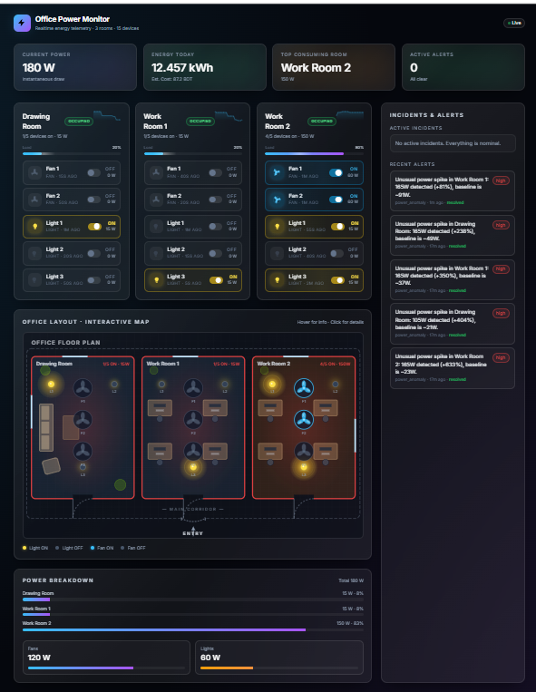
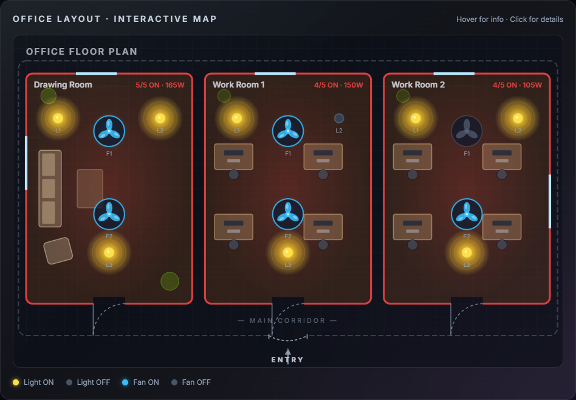
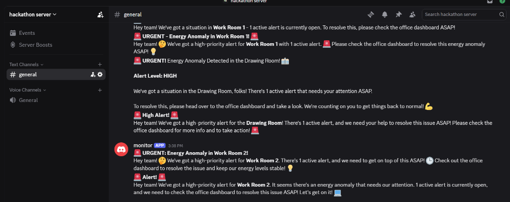
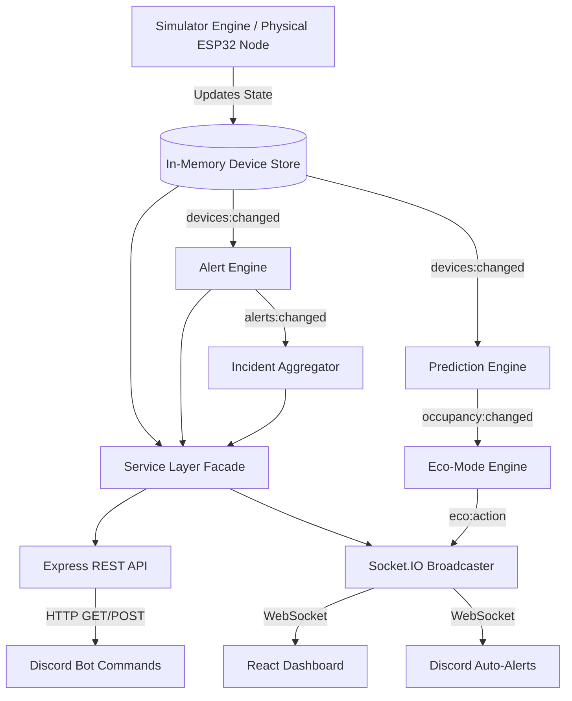

<div align="center">
  
  
  # Office Power Monitor
  **Real-Time Office Electricity & IoT Management Platform**

  [](#)
  [](#)
  [](#)
  [](#)
  [](#)
  [](#)

</div>

<br />

## 📖 Project Overview

The **Office Power Monitor** is an enterprise-grade IoT platform built to track, analyze, and alert on real-time electricity consumption across multiple office rooms. Designed with a **single source of truth**, this monorepo features a live simulator, a highly scalable Node.js/Socket.IO backend, a premium React glassmorphism dashboard, and a fully integrated Discord Bot for chat-ops.

The default configuration simulates an office with **3 rooms** (Drawing Room, Work Room 1, Work Room 2) and **15 devices** — exactly **2 Fans and 3 Lights per room** — matching the official problem setter floor plan. The interactive SVG map renders each room with accurate furniture: a sofa and coffee table in the Drawing Room, and 4-desk workstations in Work Room 1 and Work Room 2. Structural windows are rendered on the correct walls. The internal physics engine dynamically simulates power draw, respects working hours, calculates instantaneous W and cumulative kWh, and automatically raises incident alerts for anomalous usage.

---

## ✨ Features

- 🔋 **Live Telemetry:** Zero-polling, instantly broadcasted state synchronization using Socket.IO.
- 🏢 **Interactive Floor Plan & Device Management:** A beautifully animated SVG office layout where fans spin and lights glow. From the dashboard, users can click device chips to **remotely toggle** hardware on and off in real-time.
- 🚨 **Smart Alert Engine:** Automatically detects and escalates anomalies (e.g., lights left ON after hours, rooms ON continuously for >2 hours).
- 🧠 **AI Root Cause Analysis:** Integrates with the **Hugging Face Inference API** to automatically generate enterprise-grade, professional root-cause analyses for power anomalies.
- 📉 **Waste Optimizer & Eco-Mode:** Utilizes a custom Logistic Regression prediction engine to identify empty rooms. If devices are left on in an unoccupied room, the system flags the wasted BDT cost and, after a 5-minute grace period, **automatically shuts down** the offending devices via Eco-Mode.
- 🧠 **Incident Aggregator:** Groups related hardware alerts into deduplicated incidents to prevent dashboard spam.
- 🤖 **Discord Chat-Ops:** Full command suite (`!status`, `!room`, `!usage`, `!alerts`) wrapped in rich embeds for chat-based monitoring.
- 🔌 **Enterprise Architecture:** Strict separation of concerns (MVC), Dependency Injection, Class-based Service Layers, and Swagger-ready REST APIs.

---

## 📸 Screenshots

> *(Hackathon Note: Replace these placeholders with actual screenshots prior to presentation)*

| Main Dashboard | Interactive Floor Plan | Discord Bot (Embeds & Alerts) |
| :---: | :---: | :---: |
|  |  |  |

### 🎬 End-to-End Demo (Shared Backend Proof)

A single GIF that proves both interfaces read from **one** live backend: toggle a
device from the dashboard → the tile updates in real time → the Alert Engine
fires → the Discord bot posts an embed in the channel — all within seconds.

<p align="center">
  
</p>

<details>
<summary><b>How this GIF was recorded (reproduce it)</b></summary>

1. Start all three services (see [Setup & Installation](#-setup--installation)):
   `backend` (port 4000), `frontend` (port 5173), `bot` (with a valid
   `DISCORD_TOKEN` and `ALERT_CHANNEL_IDS`).
2. Arrange the screen side-by-side: React dashboard on the left, Discord channel
   on the right.
3. In the dashboard, open **Demo Controls** and toggle devices in a single room
   (or click the interactive device chips directly).
4. Fast-forward simulated time past `OFFICE_HOUR_END` (or temporarily set
   `OFFICE_HOUR_END` low in `backend/.env`) so the alert engine trips
   `room_on_after_hours` / `room_on_too_long`.
5. Watch the `IncidentPanel` update live **and** the bot post an embed in the
   configured Discord channel — both driven by the same Socket.IO stream from
   `backend/src/sockets/socketBroadcaster.js`.
6. Record with [ScreenToGif](https://www.screentogif.com/) (Windows) or
   [Peek](https://github.com/phw/peek) (Linux); export at ≤ 10 fps, ≤ 8 MB,
   save to `docs/media/demo-end-to-end.gif`.

</details>

---

## 🏗️ Architecture & System Diagram

The system operates on an event-driven loop. The underlying stores are the single source of truth. As hardware state mutates, events bubble up through the Service Layer to the REST API, Alert Engine, Eco-Mode Engine, and SocketBroadcaster simultaneously.



---

## 🛠️ Tech Stack

| Layer | Technologies |
| :--- | :--- |
| **Backend** | Node.js, Express, Socket.IO, Winston Logger, Swagger-JSDoc |
| **Frontend** | React 18, Vite 5, Tailwind CSS, Framer Motion, React-Router-DOM |
| **AI Integration** | Hugging Face API (`meta-llama/Llama-3.2-3B-Instruct`) |
| **Discord Bot** | Discord.js v14, Socket.IO-Client |
| **Hardware Node** | ESP32, ACS712 Current Sensor, Opto-isolated Relays (Simulated) |

---

## 📂 Folder Structure

```text
office-power-monitor/
├── backend/            # Express REST API, Event Engines, Socket.IO Broadcaster
│   ├── src/services/   # Class-based Dependency Injection layer
│   ├── src/routes/     # API Controllers with standardized JSON envelopes
│   └── src/server.js   # Application bootstrap
├── frontend/           # React SPA
│   ├── src/components/ # Reusable UI pieces (Glassmorphism)
│   ├── src/hooks/      # Real-time state management (useLiveData)
│   └── src/index.css   # Global styling and Tailwind configurations
├── bot/                # Discord Bot
│   ├── src/commands.js # Modular command registry (!status, !alerts)
│   └── src/llm.js      # OpenAI prompt polishing integration
├── hardware/           # Hardware reference implementation guides
└── README.md           # You are here
```

---

## 🚀 Setup & Installation (Docker)

The fastest and most reliable way to run the entire Office Power Monitor stack (Backend, Frontend, and Bot) is using **Docker Compose**.

### Prerequisites
- [Docker](https://docs.docker.com/get-docker/) installed and running.
- [Docker Compose](https://docs.docker.com/compose/install/)

### 1. Configuration
First, copy the global environment template:
```bash
cp .env.example .env
```
Open the new `.env` file and fill in your `DISCORD_TOKEN`, `ALERT_CHANNEL_IDS`, and `OPENAI_API_KEY` (if using).

### 2. Build and Run
Start the entire stack in detached mode:
```bash
docker compose up --build -d
```
That's it! The services will automatically wire themselves together over a private Docker network.

- **Frontend Dashboard:** `http://localhost:5173`
- **Backend API:** `http://localhost:4000`
- **Discord Bot:** Runs silently in the background.

### 3. Useful Docker Commands
- **View Live Logs:** `docker compose logs -f`
- **Stop the Stack:** `docker compose down`
- **Rebuild after code changes:** `docker compose up --build -d`

---

## 🚀 Setup & Installation (Manual Node.js)

If you prefer to run the services individually without Docker, you can start them manually. Ensure you have **Node.js 20+** installed.

1. **Backend:** `cd backend && npm install && npm start` (Port 4000)
2. **Frontend:** `cd frontend && npm install && npm run dev` (Port 5173)
3. **Bot:** `cd bot && npm install && npm start`

---

## 🔌 API Documentation

The backend adheres to a strict RESTful envelope: `{ success: boolean, data: { ... }, error?: { ... } }`.

- **`GET /api/devices`** - Array of raw device telemetries.
- **`GET /api/rooms`** - Aggregated summary of power consumption per room.
- **`GET /api/usage`** - High-level metrics, total Watts, and estimated daily kWh.
- **`GET /api/alerts?status=active`** - Fetch system warnings and errors.
- **`GET /api/incidents`** - Fetch deduplicated incident tickets.

*(Full API spec can be found internally via Swagger comments on the router controllers).*

---

## 🔧 Hardware Documentation

Want to transition from the software simulator to real-world edge devices? 
We have fully mapped out the **ESP32 + ACS712 + Relay Module** circuitry required to build a physical room node. Because the SaaS architecture is entirely decoupled and event-driven, swapping the virtual simulator for physical HTTP/MQTT payloads requires zero downstream logic changes.

👉 [View the complete Hardware Design Guide here](hardware/CIRCUIT_DESIGN.md).

---

## 🔮 Future Improvements

- [ ] **Historical Database:** Migrate from the in-memory Singleton store to PostgreSQL/TimescaleDB for permanent time-series retention.
- [ ] **User Authentication:** Add JWT-based Auth to the REST API and a login portal to the React frontend.
- [ ] **MQTT Bridge:** Implement a dedicated MQTT broker (`Mosquitto`) to support direct bidirectional communication with thousands of physical ESP32 nodes simultaneously.
- [ ] **Hardware Prototyping:** Transition from Wokwi simulation to physical PCB manufacturing for the room nodes.

---
<div align="center">
  <i>Built with ❤️ for the Hackathon</i>
</div>
