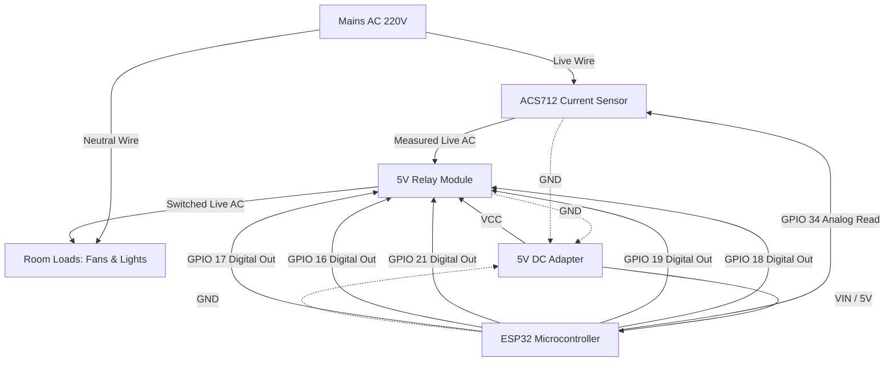

# ESP32 Room Controller Circuit Design

This document outlines the hardware architecture required to implement a
physical node for the Office Power Monitor system. A single node represents one
"Room" (e.g., Drawing Room, Work Room 1), responsible for toggling physical
loads and measuring power consumption.

## Core Components

1. **Microcontroller**: ESP32 (NodeMCU or DevKit V1)
   - Handles WiFi communication (WebSocket connection to backend)
   - Operates GPIO for relays and reads Analog values from the current sensor.
2. **Current Sensor**: ACS712 (5A or 20A module)
   - Hall-effect based linear current sensor.
   - Outputs an analog voltage proportional to the AC current passing through
     it.
3. **Actuators**: 4-Channel or 8-Channel 5V Relay Module (Active Low)
   - Opto-isolated relay board to switch the 220V/110V AC loads (Fans, Lights).
4. **Power Supply (Logic)**: 5V 2A DC Power Adapter
   - Provides stable power to the ESP32 (via `VIN`) and the Relay Module
     (`VCC`).
5. **Power Supply (Load)**: Mains AC (110V/220V)
   - Wired strictly through the normally-open (NO) contacts of the relays.

### High-Level Circuit Block Schematic

---

## GPIO Mapping (Representative Room)

Each room node controls 5 devices (3 Lights, 2 Fans) per the office spec.

| Component             | ESP32 Pin | Type           | Description                                  |
| --------------------- | --------- | -------------- | -------------------------------------------- |
| **Relay 1**           | GPIO 18   | Digital Output | Controls Light 1                             |
| **Relay 2**           | GPIO 19   | Digital Output | Controls Light 2                             |
| **Relay 3**           | GPIO 21   | Digital Output | Controls Light 3                             |
| **Relay 4**           | GPIO 16   | Digital Output | Controls Fan 1                               |
| **Relay 5**           | GPIO 17   | Digital Output | Controls Fan 2                               |
| **ACS712 Sensor Out** | GPIO 34   | Analog Input   | Reads total current draw of the room (ADC 1) |

_Note: ADC1 pins (like GPIO 34) are preferred on ESP32 when using WiFi, as ADC2
is consumed by the WiFi driver._

---

## Circuit Explanation

### 1. Logic Layer

The ESP32 acts as the brain. It runs a lightweight WebSocket client that
subscribes to the Node.js backend. When the backend `SocketBroadcaster` emits a
device state change for this specific room, the ESP32 drives the corresponding
GPIO pin HIGH or LOW. Because most relay modules are **active-low**, pulling a
GPIO `LOW` will activate the relay and turn the device ON.

### 2. Sensing Layer

To monitor power, the **ACS712** is wired in series with the _Live_ AC wire
feeding the entire relay bank.

- The ACS712 outputs `VCC / 2` (around 2.5V) at 0 amps.
- As AC current flows, the voltage oscillates above and below 2.5V.
- The ESP32 continuously samples GPIO 34 at high speed to find the Root Mean
  Square (RMS) voltage, converts it to RMS current, and multiplies by the local
  mains voltage (e.g., 230V) to calculate the total Real Power (Watts).
- This metric is published back to the backend.

### 3. Isolation & Safety

The Relay Module uses optocouplers to physically separate the 3.3V ESP32 logic
from the relay coils and the high-voltage AC lines. The AC wiring never
intersects with the DC logic board.

---

## Wokwi Implementation Readiness

This design is fully compatible with **Wokwi** (the online electronics
simulator) for hackathon demonstrations.

**To implement in Wokwi:**

1. Add an `ESP32` board to the workspace.
2. Add 5 LED components (representing the 220V loads for visual feedback — 3
   lights + 2 fans) and connect them to GPIOs 18, 19, 21, 16, and 17 through
   330Ω resistors.
3. Add a `Slide Potentiometer` connected to GPIO 34. In Wokwi, simulating AC
   current via an ACS712 is complex. Instead, map the potentiometer's 0-3.3V
   output directly to a 0-100W variable in the ESP32 code to simulate the total
   room wattage changing dynamically.
4. Flash standard Arduino/C++ code utilizing `WiFi.h` and `WebSocketsClient.h`.

---

## Simulation vs. Real-World Parity

Currently, the Office Power Monitor project utilizes a Node.js
`Simulator Engine` to mimic hardware state and generate power metrics.
**However, this software design perfectly represents the real-world hardware
architecture for the following reasons:**

1. **State Ownership**: In the real world, an ESP32 is an edge device acting as
   a dumb terminal. The backend database remains the source of truth for
   "desired state". The ESP32 simply syncs its relays to match the backend
   state, identical to how our Node.js Simulator flips virtual booleans.
2. **Event-Driven Architecture**: Our software `Alert Engine` and
   `Incident Aggregator` are entirely decoupled from _how_ data enters the
   system. Whether a wattage metric arrives from a mocked `setInterval` or an
   HTTP POST from a physical ESP32 reading an ACS712, the downstream
   deduplication, alerting, and WebSocket broadcasting remain 100%
   mathematically and structurally identical.
3. **Power Calculation Mathematics**: The Node.js simulator aggregates fixed
   wattage profiles (e.g., 60W for a fan). In a physical setup, an ESP32
   aggregates the raw RMS current from the ACS712. In both scenarios, the
   absolute `Total Watts` integer arrives at the API boundary in the exact same
   format. The heavy lifting of the SaaS (analytics, deduplication, real-time UI
   mapping) is entirely hardware-agnostic.
