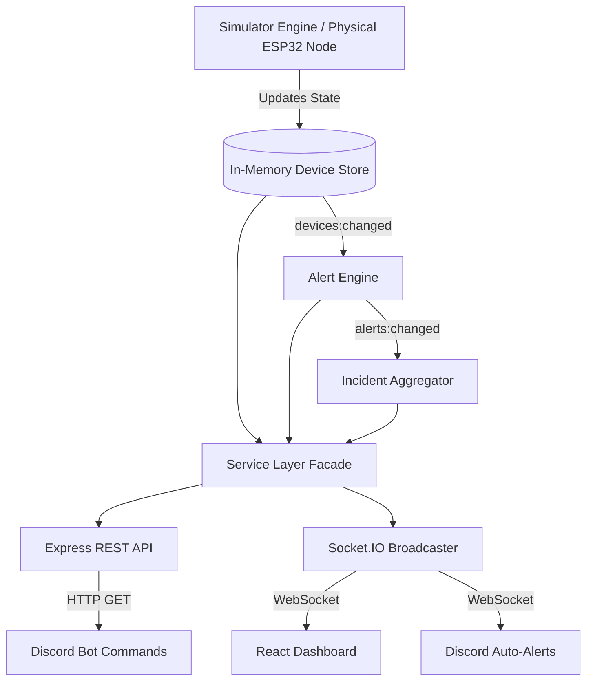

<div align="center">
  
  
  # Office Power Monitor
  **Real-Time Office Electricity & IoT Management Platform**

  [](#)
  [](#)
  [](#)
  [](#)
  [](#)
  [](#)

</div>

<br />

## 📖 Project Overview

The **Office Power Monitor** is an enterprise-grade IoT platform built to track, analyze, and alert on real-time electricity consumption across multiple office rooms. Designed with a **single source of truth**, this monorepo features a live simulator, a highly scalable Node.js/Socket.IO backend, a premium React glassmorphism dashboard, and a fully integrated Discord Bot for chat-ops.

The default configuration simulates an office with **3 rooms** (Drawing Room, Work Room 1, Work Room 2) and **15 devices** (Lights & Fans). The internal physics engine dynamically simulates power draw, respects working hours, calculates instantaneous W and cumulative kWh, and automatically raises incident alerts for anomalous usage.

---

## ✨ Features

- 🔋 **Live Telemetry:** Zero-polling, instantly broadcasted state synchronization using Socket.IO.
- 🏢 **Interactive Floor Plan:** A beautifully animated SVG office layout where fans physically spin and lights glow when active.
- 🚨 **Smart Alert Engine:** Automatically detects and escalates anomalies (e.g., lights left ON after hours, rooms ON continuously for >2 hours).
- 🧠 **Incident Aggregator:** Groups related hardware alerts into deduplicated incidents to prevent dashboard spam.
- 🤖 **Discord Chat-Ops:** Full command suite (`!status`, `!room`, `!usage`, `!alerts`) wrapped in rich embeds, featuring **OpenAI LLM Response Polishing**.
- 🔌 **Enterprise Architecture:** Strict separation of concerns (MVC), Dependency Injection, Class-based Service Layers, and Swagger-ready REST APIs.

---

## 📸 Screenshots

> *(Hackathon Note: Replace these placeholders with actual screenshots prior to presentation)*

| Main Dashboard | Interactive Floor Plan | Discord Bot (Embeds & Alerts) |
| :---: | :---: | :---: |
|  |  |  |

---

## 🏗️ Architecture & System Diagram

The system operates on an event-driven loop. The underlying stores are the single source of truth. As hardware state mutates, events bubble up through the Service Layer to the REST API, Alert Engine, and SocketBroadcaster simultaneously.



---

## 🛠️ Tech Stack

| Layer | Technologies |
| :--- | :--- |
| **Backend** | Node.js, Express, Socket.IO, Winston Logger, Swagger-JSDoc |
| **Frontend** | React 18, Vite 5, Tailwind CSS, Framer Motion, React-Router-DOM |
| **Discord Bot** | Discord.js v14, Socket.IO-Client, OpenAI API |
| **Hardware Node** | ESP32, ACS712 Current Sensor, Opto-isolated Relays (Simulated) |

---

## 📂 Folder Structure

```text
office-power-monitor/
├── backend/            # Express REST API, Event Engines, Socket.IO Broadcaster
│   ├── src/services/   # Class-based Dependency Injection layer
│   ├── src/routes/     # API Controllers with standardized JSON envelopes
│   └── src/server.js   # Application bootstrap
├── frontend/           # React SPA
│   ├── src/components/ # Reusable UI pieces (Glassmorphism)
│   ├── src/hooks/      # Real-time state management (useLiveData)
│   └── src/index.css   # Global styling and Tailwind configurations
├── bot/                # Discord Bot
│   ├── src/commands.js # Modular command registry (!status, !alerts)
│   └── src/llm.js      # OpenAI prompt polishing integration
├── hardware/           # Hardware reference implementation guides
└── README.md           # You are here
```

---

## 🚀 Setup & Installation

Ensure you have **Node.js 18+** installed. The project is split into three independent services.

### 1. Running the Backend (Core Engine)
The backend hosts the REST API, the Simulator, and the WebSocket broadcaster.
```bash
cd backend
cp .env.example .env
npm install
npm start
```
> **Backend runs on:** `http://localhost:4000`

### 2. Running the Frontend (Dashboard)
The React dashboard consumes the live Socket.IO stream.
```bash
cd frontend
cp .env.example .env
npm install
npm run dev
```
> **Frontend runs on:** `http://localhost:5173`

### 3. Running the Discord Bot (Optional)
The bot provides Chat-Ops and realtime Discord alerts.
```bash
cd bot
cp .env.example .env
# Important: Open .env and add your DISCORD_TOKEN
npm install
npm start
```
> **Note:** To enable OpenAI polishing and auto-relays, ensure `OPENAI_API_KEY` and `ALERT_CHANNEL_IDS` are populated in the `.env`.

---

## 🔌 API Documentation

The backend adheres to a strict RESTful envelope: `{ success: boolean, data: { ... }, error?: { ... } }`.

- **`GET /api/devices`** - Array of raw device telemetries.
- **`GET /api/rooms`** - Aggregated summary of power consumption per room.
- **`GET /api/usage`** - High-level metrics, total Watts, and estimated daily kWh.
- **`GET /api/alerts?status=active`** - Fetch system warnings and errors.
- **`GET /api/incidents`** - Fetch deduplicated incident tickets.

*(Full API spec can be found internally via Swagger comments on the router controllers).*

---

## 🔧 Hardware Documentation

Want to transition from the software simulator to real-world edge devices? 
We have fully mapped out the **ESP32 + ACS712 + Relay Module** circuitry required to build a physical room node. Because the SaaS architecture is entirely decoupled and event-driven, swapping the virtual simulator for physical HTTP/MQTT payloads requires zero downstream logic changes.

👉 [View the complete Hardware Design Guide here](hardware/CIRCUIT_DESIGN.md).

---

## 🔮 Future Improvements

- [ ] **Historical Database:** Migrate from the in-memory Singleton store to PostgreSQL/TimescaleDB for permanent time-series retention.
- [ ] **User Authentication:** Add JWT-based Auth to the REST API and a login portal to the React frontend.
- [ ] **MQTT Bridge:** Implement a dedicated MQTT broker (`Mosquitto`) to support direct bidirectional communication with thousands of physical ESP32 nodes simultaneously.
- [ ] **Hardware Prototyping:** Transition from Wokwi simulation to physical PCB manufacturing for the room nodes.

---
<div align="center">
  <i>Built with ❤️ for the Hackathon</i>
</div>
